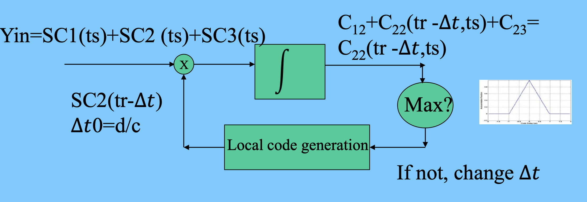

# 2 GPS Receiver and Observables
> - c = 3 * 10^8 m/s
> - GHz = 1.5 * 0^9 Hz
> - wavelength(λ) = c / f

1. PRN (Pseudo-Random Noise) Codes (伪随机噪声码) 用于测量时间延迟
   1. P code 精度更高 频率更高
   2. C/A (coarse/acquisition) Code
2. D Navigation Message (50 bit/s)
    – information about the system and ephemeris

3. Modulo 2 Addition (异或运算) & Binary Phase Shift Keying(BPSK)
    - The carrier is instantaneously phase shifted by 180◦ at the time of a chip change
    - 1 ⊕ 1 = 0
    - 0 ⊕ 1 = 1
    - 1 ⊕ 0 = 1
    - 0 ⊕ 0 = 0

4. Pseudo-Random Noise Code
   1. CDMA (Code Division Multiple Access) 同于区分不同卫星
   2. For PRN codes, cross-correlation 不同卫星的PRN码不相关
    – C_ij = 0 if i ≠ j
    – Codes from two satellites are not correlated
   3. Self-correlation 对齐的越好，相关性越高， 值越接近 1

5. Navigation Message
    -  50 bit/s
    - Complete Message: 25 Frames
    - Each Frame: 1500 bits (30 s)
    - Information
        - Clock Correction
        - ephemeris, almanac
        - ionospheric correction (for single freq. user)
        - ...
    - TLM, a telemetry word includes a synchronization pattern and some diagnostic messages.
    - The handover word, HOW contains the GPS system time (Z count), identifying the epoch of a data record.

## GNSS RECEIVER
1. Delay Lock Loop (DLL) delta T For Psuedo Range
   1. DLL to measure two code phase angle difference
   2. Based on Correlation property of code
   3. 同时搜集多颗卫星的信号（不同的卫星相关性为0），通过不断调整延迟，直到找到最大相关性 1，此时得到的就是延迟时间
   4. 
2. Phase Lock Loop (PLL) delta Phi For Carrier Phase
   1. 当cos达到最大，则可以得到相位差（卫星及接收机的相位差）
   2. PLL outputs the carrier phase angle difference and Doppler effects

## Pseudorange
未知数 = 4
## Carrier Phase Principle
- 未知数 = n + 4
- 但是我们只有n个载波观测方程，所以无法解出所有的未知数。但是，整周不确定数(Integer Ambiguity)是一个整数，所以我们可以通过整周模糊度解决这个问题。

## Linear combination of observations
### Single difference of Pseudorange of same frequency
- 卫星见求差可以去除与卫星相关的误差
- 接收机见求差可以去除与接收机相关的误差
- 不同 epochs 之间求差可以去除 Ambiguity
- SD between stations: remove satellite clock error; reduce atmosphere refraction errors; reduce satellite orbit error;
- SD between satellites: remove receiver clock error;
- SD between epochs: eliminate ambiguities

### Typical Double Difference – between stations and satellites
- 广泛使用
- 噪声会增大，但是可以同时去除卫星和接收机的误差
- 同时也可以减少由大气层引起的误差（因为两个信号经过的大气情况相同）

### Triple difference
相较于 Double Difference，Triple Difference 可以去除 Ambiguity

### Combination with two frequency data
Ionospheric Delay is frequency related