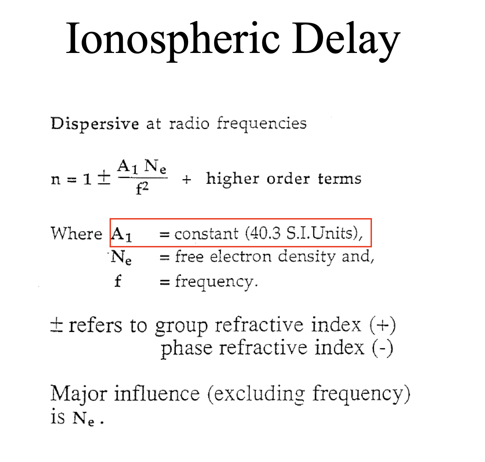
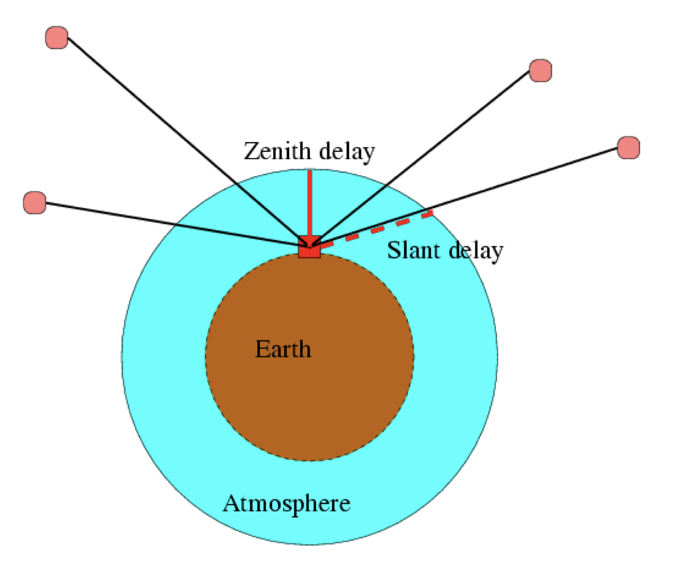

# GPS Measurement Errors and Corrections

## 1. Errors related to Satellite
1. Channel Bias

## 2. Errors related to Receiver
1. Measurement noise : 多次测量以去除噪声，如平均值。不同次测量的噪声可以相互抵消，因为噪声在真值上下震荡。
2. Clock
    –  Solved together with position parameters 二次测量，卫星间的差值可以消除钟差
    –  Differencing method cancels out
    –  Very low quality of clock can cause loss of lock

3. Channel Bias
    – Mainly associated with Pseudorange
    – Due to the delay of codes in Hardware
    – Main concern is the difference between L1 and L2 Channels
    - Improvement
        – A nearly constant bias (for certain period, i.e. one day)
        – Solve as another parameters

4. Error related to propagation
   - Bending ： 由于大气层密度不均匀，导致信号弯曲，使得信号传播路径变长，从而导致误差。（类似于折射，与入射角相关）
   - Delay ： 由于大气层的存在，导致信号传播速度变慢，从而导致信号传播时间延长，从而导致误差。
- Ionosphere
    – Frequency dependent
- Troposphere
    – Frequency independent (microwave bands)
- Multipath
    – Frequency dependent
- The microwave ray is bent and slow down
    – Distance is different from straight line
    – Time delay is longer than in the vacuum
- Ionospheric Delay 对伪距和载波相位存在相反的影响
    – 伪距： 电离层延迟导致伪距增大
    – 载波相位： 电离层延迟导致载波相位减小
    - p1 = d + I_1 * 40.3 * TEC / f1^2
    - p2 = d + I_2 * 40.3 * TEC / f2^2
    - 不同的频率导致不同的延迟，频率越高，延迟越小
    - TEC : Total Electron Content
    - VTEC : Vertical Total Electron Content
    - TEC = MappingFunction * VTEC
    - Ionospheric Scintillation
      - Due to the disturbance of ionosphere
        – Solar activity
        – Geomagnetic Field
      - Cause interferences on Radio signal
        – Amplitude variation
        – Phase variation
- 
  - Ne: 电子密度（太阳活动、季节影响、一天之内的变化）
  - Vertical Range Error: 不同的卫星高度角不同，导致信号在大气层中传播的距离不同，从而导致不同的误差。

- Tropospheric delay
  - 只与温度、湿度及气压有关
  - 与波（频率、波长）无关
  - Total delay = VDry * MappingFunction_d(alpha) + VWet * MappingFunction_w(alpha)
  - 将 VerticalDelay 视作未知数，通过多次观测，可以消除 VerticalDelay 的影响
  - Estimation of tropo. Delay using GPS
  - F =f/c(d-ion+Vtrop*MF)+clock terms + N + nF

- The zenith total delay, ZTD, which can be estimated processing data from ground based GPS receivers, is sensitive to properties of the atmosphere of importance to meteorology, paricularly water vapour content in air which is the most dynamic parameter in atmosphere. （用于测量大气层水汽，以预报天气）
  - 

## 3. Multipath Effects
- DGPS can not remove multipath errors 不同测站之间的多路径效应是不相关的，无法通过差分消除
- 影响因素
  - 环境
  - 天线设计
- 不是随机误差，因为与环境有关，可以通过环境改变来消除
- 多路径效应可以复现（环境不变），因为卫星运行轨迹每二十四个小时重复一次（严格讲是23h 56min）所以后一天在同一时间（早4min）会有相同的多路径效应