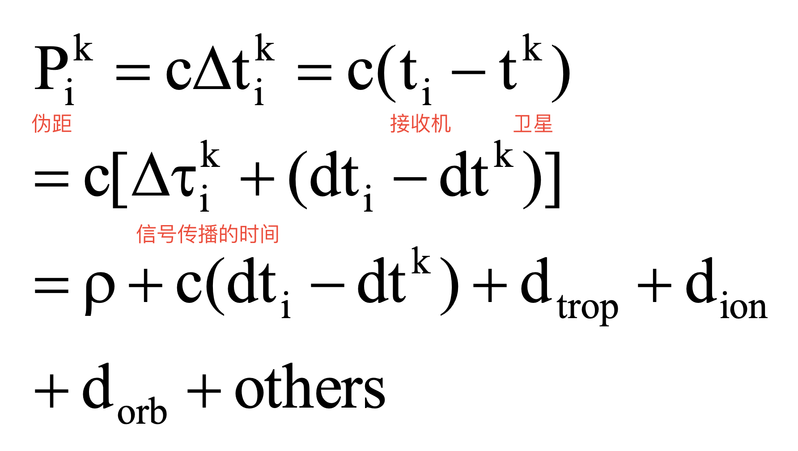
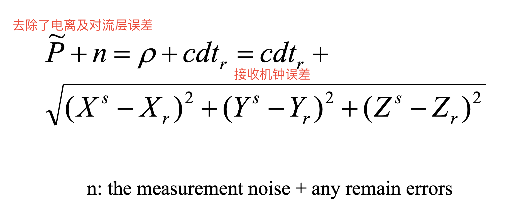
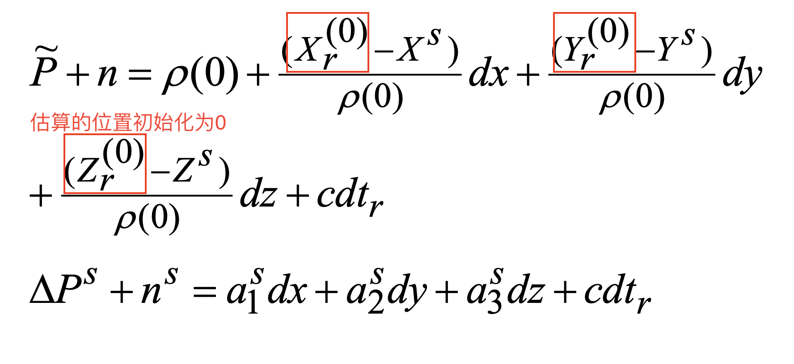

# Positioning with GNSS
## 
1. 三种确定卫星位置的方法 Sources for satellite orbits
    – from broadcast ephemeris (Keplerian elements)
    – from IGS (coordinates every 15 min)
    – Calculate them with a ground network

2. 伪距测量及误差来源

- Related to Satellite
    – satellite clock (modeling and correction)
    – Ephemeris (broadcast ephemeris)
- Related to Receiver
    – Measurement noise
    – Receiver clock (modeling with an unknown parameter)
- Related to propagation
    – Troposphere delay (modeling and correction)
    – Ionosphere delay (function of frequency) (modeling and correction or use of ionosphere-free observation)

## DOP (Dilution of Precision)
- The effects of satellite geometric distribution on the accuracy of navigation solution
- Used to measure the geometric strength of positioning
- Transformation from XYZ-system to local NEH-system (uvw-system)

Computing DOP, we do not need measurements, only satellite positions. Thus we can predicate the precision of GNSS positioning. DOP can also be used for the design of satellite constellation. 

- DOP 越小，定位精度越高
- The lower the DOP value, the more precise position and time
- 水平定位精度要高于垂直定位，因为我们无法收到地下的卫星信号

| DOP | Description |
| --- | --- |
| GDOP | Geometric Dilution of Precision |
| PDOP | Position Dilution of Precision |
| HDOP | Horizontal Dilution of Precision |
| VDOP | Vertical Dilution of Precision |
| TDOP | Time Dilution of Precision |

## Differential GPS (DGPS)
- 一定区域接收机的误差都是差不多的。Most of GPS errors sources are spatially correlated, such as satellite orbit, satellite clock, ionospheric and tropospheric delays =>The effects of those error sources are similar to all receivers in a region
- 使用改正数来减小误差。Set a receiver at known point would be able to detect the sum of all these errors => improve positioning accuracy of other users

Error Sources
– Related to satellites (Orbit, clock)
– Related to receiver (Clock, noise) 无法通过 dgps 修正
– Related to propagation (trop and iono delays, multipath)
- Multipath can’t be reduced with DGPS

- Components of a DGPS system
    - Reference stations
    - Data Processing Centre
– Generate Range Correction and Correction Rates for each satellites
– Integrity Checks
    - Transmitters
– to send corrections to the users
    - User with a receiver to obtain differential corrections
  
## Positioning with Carrier Phase

## ill-Condition Problem
- do not have a unique solution / In theory, can have a solution, but the solution is very sensitive to errors
- Possible Source: When the observation time is too short
- Due to various sources of errors affecting phase observations the estimated ambiguities will not be integers
  - floating DD solution
  - fixed DD solution

## Ambiguity Resolution

## Repair of Cycle Slips
Editing Cycle Slips
– polynomial fitting
– triple differencing
– double differencing residuals (outlier detection in LS)