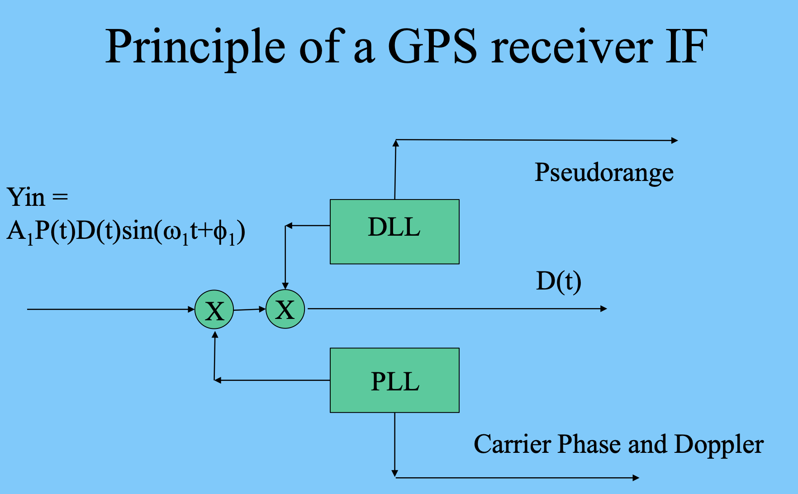
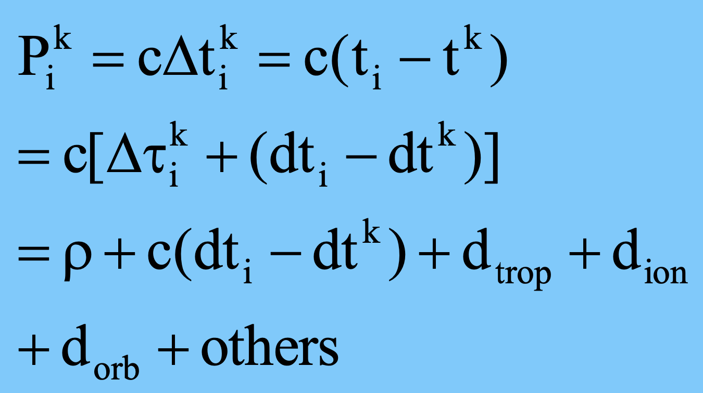
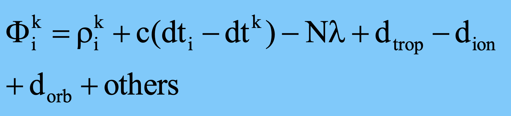
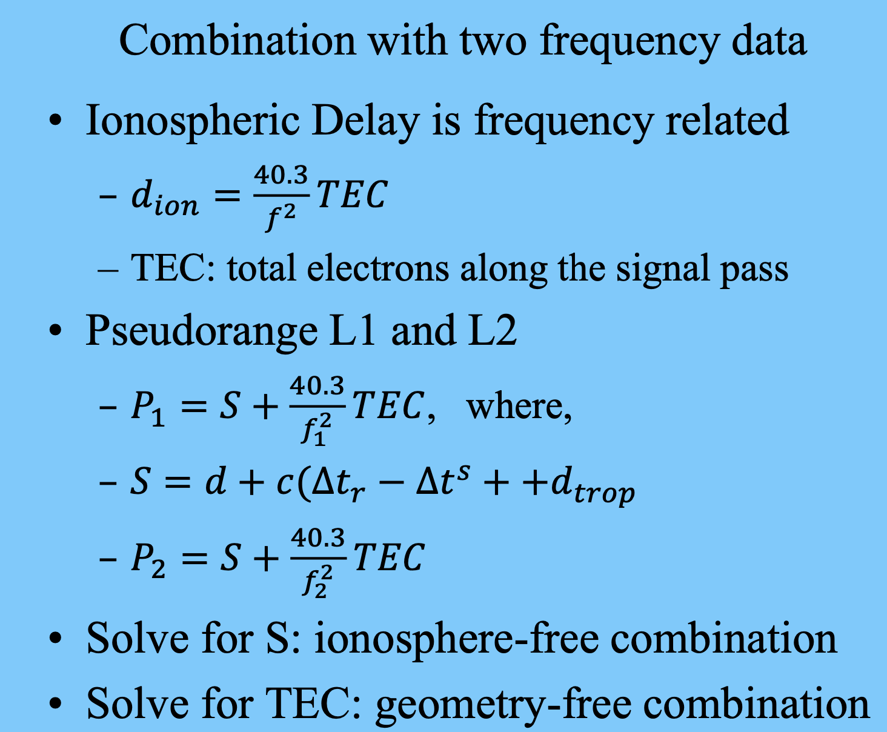

# GPS Receiver and Observables
1. Signal Form
   - L1: P code, C/A code, and Nav. Message, 1575.42 MHz (wavelength: 19 cm)
   - L2: P code, Nav. Message, 1227.60 MHz (wavelength: 24 cm)
   - PRN (Pseudo-Random Noise) Codes : Binary sequences with noise-like properties
   - P code: 10.23 MHz (30m), 266 days long, cut into 7-day long segments to each satellite – each satellite assigned a PRN number
   - C/A (coarse/acquisition) Code: 1.023 MHz (300m) (1 ms long)
   - Navigation Message (50 bit/s) : information about the system and ephemeris

2. Phase Modulation (PM) / 相位调制 : Phase modulation is a technique where the phase of a carrier signal is varied according to the instantaneous value of the information signal. For instance, the carrier’s phase may shift by 180° at each data transition.相位调制是一种通过根据信息信号的瞬时值改变载波信号相位的调制技术。例如，在数据跳变时载波相位可能发生180°的偏移。

3. Pseudo-Random Noise Code
    - Generated using Feedback Shift Register (FBSR)
    - Spectrum similar to noise
    - Good Correlation Property
    - Each satellite has different codes
    - Used mainly for Identification (CDMA) \range measurement
    - Correlation Property of PRN codes : Codes from two satellites are not correlated. All he P codes From different satellites are not corrected, although they come from one PRN series.

4. Navigation Message
   - 50 bit/s Complete Message: 25 Frames Each Frame: 1500 bits (30 s)
   - Information - Clock Correction - ephemeris, almanac - ionospheric correction (for single freq. user)

5. Delay Lock Loop (DLL) : DLL to measure two code phase angle difference Based on Correlation property of code. DLL outputs the signal time delay from satellite to receiver.
6. Phase Lock Loop : PLL is to match two carrier phase angle difference. PLL outputs the carrier phase angle difference and Doppler effects. 
   - 

6. Pseudorange

- Related to Satellite
    – satellite clock
    – Ephemeris (satellite position)
    – Hardware delay
- Related to Receiver
    – Measurement noise
    – Receiver clock
    – Hardware delay
- Related to propagation
    – Troposphere refraction (same for all GPS frequencies)
    – Ionosphere refraction: delay PR (group velocity) and advance CP (phase velocity); function of frequency

7. Carrier Phase : Carrier Phase Measurement is the phase difference between Receiver and Satellite Signals. 

- A cycle slip occurs when the integer ambiguity N, which represents the initial epoch of a continuous signal tracking, changes suddenly due to a signal interruption or blockage.
- 周跳是指由于信号中断或遮挡，代表连续信号跟踪初始历元的整数模糊度 N 发生突变的现象。

The major differences between carrier phase and pseudorange measurements are as follows:
- Ambiguity: Carrier phase measurements have an inherent integer ambiguity.
- Ionospheric delay: The delay affects both measurements equally in magnitude but with opposite signs.
- Measurement noise: Carrier phase noise is approximately 2 mm, whereas pseudorange noise is around 1 m.

载波相位和伪距测量的主要区别如下：
- 模糊性：载波相位测量具有固有的整数模糊性。
- 电离层延迟：延迟对两种测量的影响大小相同，但符号相反。
- 测量噪声：载波相位的噪声约为 2 毫米，而伪距噪声约为 1 米。

8. Linear combination of observations
- Single difference (SD)
  - SD between stations: remove satellite clock error; reduce atmosphere refraction errors; reduce satellite orbit error;
  - SD between satellites: remove receiver clock error;
  - SD between epochs: eliminate ambiguities
- Double Difference & Triple difference
    - Relative positioning commonly use DD;
    - For short distance others errors can be neglected
    - TD is used to check cycle slips

9. TEC (Total Electron Content) refers to the total number of electrons along the path of a signal as it travels through the ionosphere. TEC（总电子含量）指的是信号在通过电离层时沿路径经过的总电子数量。

