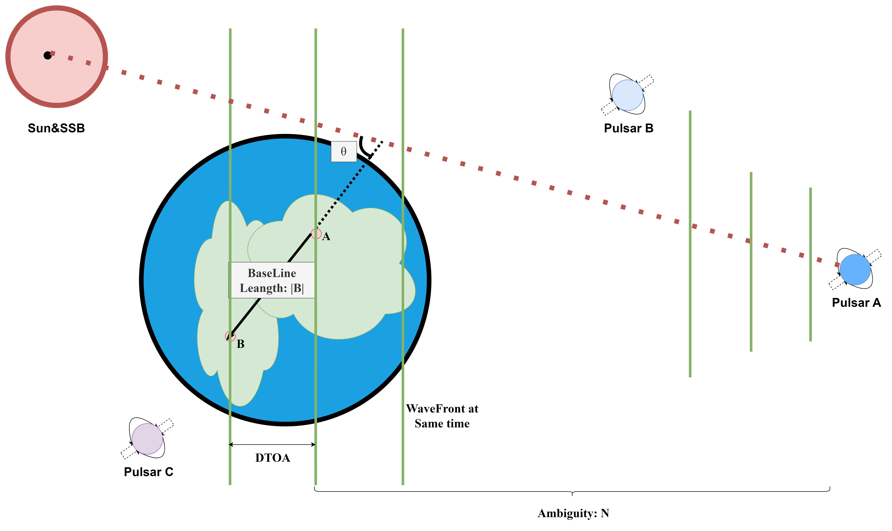

# System Design and Principles
> PanZhiQing

## 1. Principles

### 1.1. Very Long Baseline Interferometry (VLBI)

In the case that we use a telescope with an aperture of $D$ to observe electromagnetic waves with a wavelength of $\lambda$, the angular resolution of the telescope can be estimated by the following formula:

$$
\theta^N = \frac{\lambda}{D}\rho^N \tag*{(1)}
$$

We can find that the angular resolution of the telescope is inversely proportional to the wavelength and directly proportional to the aperture, that is, when the wavelength of the electromagnetic wave being observed remains unchanged, the larger the aperture of the instrument, the smaller the angular resolution, and the higher the resolution. This also explains why radio telescopes used to observe radio waves have apertures ranging from tens of meters to hundreds of meters. At the same time, assuming that we choose shorter wavelengths of electromagnetic waves as the observation objects, such as X-rays, gamma rays, etc., we can use relatively small telescope apertures to achieve higher angular resolution, which is also the reason for using X-rays to observe pulsars. However, X-rays undergo severe attenuation when propagating in the atmosphere, and it can even be considered that the atmosphere is opaque to X-rays emitted from space, so we can only observe X-ray radiation outside the atmosphere, which is also the reason why space astronomical satellites are used in X-ray astronomy.

Interferometric measurement technology is a technique for determining the position of a source by measuring the phase difference between two or more sources. If we use two radio telescopes that are far apart to observe the same celestial body and use interferometric measurement technology to measure the phase difference of the electromagnetic waves received by the two radio telescopes, then we can measure the position of the celestial body or perform imaging through this method [@10.1093/mnras/118.3.276]. Theoretically, as long as the two radio telescopes are far enough apart, we can obtain a "virtual" telescope with excellent angular resolution. The conventional method is to use a cable to link the two telescopes for time synchronization, but the transmission process of the long cable often brings great errors, resulting in the accuracy of interferometric measurement decreasing with the increase of the baseline length.

To solve this problem, VLBI technology came into being. VLBI technology uses atomic clocks (generally hydrogen maser) to generate timestamps, and records the observation values together with the timestamps on the storage medium, and then performs data post-processing centrally. Since two atomic clocks can ensure strict time synchronization, there is no need to use cables for time synchronization.

However, this approach has at least two bottlenecks: first, the diameter of the Earth is limited, even if we set up telescopes at the North and South Poles respectively, the baseline length will not exceed the diameter of the Earth, and the theoretical highest resolution we can obtain is also limited; second, this approach lacks real-time performance, we need to wait until all data are collected before data processing can be carried out, which is unacceptable for some astronomical phenomena that require real-time observation. For the first point, some countries have proposed to deploy telescopes in space and form a VLBI observation network with ground-based radio telescopes. For the second point, real-time data processing can be achieved by leveraging modern communication infrastructure and cloud computing technology.

In 2019, people used the Event Horizon Telescope (EHT) [@Akiyama_2019] to image a black hole, which is a successful application of VLBI technology. EHT is a VLBI synchronous observation network composed of multiple radio telescope baselines around the world, and its equivalent aperture is almost equal to the diameter of the Earth.

In summary, Very Long Baseline Interferometry can observe celestial bodies in space with extremely high resolution, providing unprecedented rich information for human beings. We can fully obtain the most accurate cosmic information database under the current technical conditions based on VLBI technology and the ultra-high-resolution cosmic observation system developed on this basis. This database records the morphology, spectrum, motion laws, and positions relative to the barycenter of the solar system (SSB) of celestial bodies in space. In the following content, we assume that this database has been loaded onto the target, and the target can read and update the database at any time.

### 1.2. VLBI Observables and Data Processing

Very Long Baseline Interferometry (VLBI) is essentially the measurement of the time difference (DTOA) and its rate of change of the electromagnetic waves radiated by the source reaching the two ends of the baseline at the same time. By observing multiple sources, the spatial coordinates of the baseline vector can be calculated and the position of the source can be determined (relative to the solar system barycenter (SSB)). Assuming that the time difference between the wavefront reaching the two ends of the baseline is $\tau_g$, we have:

$$
\tau_g = \frac{1}{c} |b| \cos \theta \tag*{(2)}
$$

Where c is the speed of light, |b| is the baseline length, $\theta$ is the angle between the baseline and the direction of the source. Since the source is quite far away, we regard the wavefront as a plane wave. In addition, since the initial state of the signal source is unknown, there will be ambiguity N, we have:

$$
c\tau = N \lambda + \Delta \lambda \tag*{(3)}
$$

In actual observations, due to equipment limitations, we cannot directly observe $\tau_g$, we can only estimate $\tau_g$ through some signal and data processing methods, such as least squares method[@Ghaderpour_2021], Fourier transform[@10.1093/mnras/118.3.276], etc.

We can linearize the observation equation for least squares estimation or Kalman filtering and other data processing methods. The basic observation equation of VLBI can be expressed as:

$$
O_t = C(X,t) + V_t \tag*{(4)}
$$

Where $O_t$ is the observation value including DTOA and its rate of change, $C(X,t)$ is the model predicted value, and $V_t$ is the observation error. Linearizing it, we have:

$$
Y = Ax + V \tag*{(5)}
$$

If the weight coefficient matrix is $P$, then the least squares estimate is:

$$
\hat{x} = (A^T P A)^{-1} A^T P Y \tag*{(6)}
$$

Where $A$ is the partial derivative matrix, $Y$ is the observation value, and $P$ is the weight coefficient matrix.

If we consider the high precision of VLBI observation, we need to consider the errors brought by the relativistic effects (such as the errors brought by the lunar, Earth, and Jupiter gravity) since the DTOA observation accuracy of VLBI is about one-thousandth of the hydrogen maser timing accuracy, that is, about $10^{-11}$ seconds, and the relativistic effect mainly acts on the speed of light, that is, about $10^{-8}$ seconds. At the same time, for such high-precision observation activities, we also need to consider the errors brought by local factors such as the atmosphere, tides, solid tides, and Earth rotation of the astronomical telescope observation station, which are similar to the errors that need to be dealt with in GPS high-precision positioning.

Based on the above principles, we can establish a VLBI observation network on Earth. By observing multiple sources, we can calculate the spatial coordinates of the baseline vector and determine the position of the source (relative to the solar system barycenter (SSB)). We can store these observation data in a database for subsequent data processing and analysis, for example, we can load it onto a spacecraft for positioning and navigation in space[@Nothnagel2017].

### 1.3. Pulsar and XNAV(X-ray Pulsar Navigation)

Pulsars were first discovered in 1967 by Jocelyn Bell Burnell, a 24-year-old graduate student of Professor Antony Hewish at the Cavendish Laboratory, University of Cambridge, when she detected signals received by a radio telescope. Pulsars are extremely dense, highly magnetized, and rapidly rotating celestial bodies, usually neutron stars or white dwarfs. Due to their high magnetization, they emit high-energy electromagnetic waves from specific directions, and due to their rapid rotation, these electromagnetic waves are detected by distant observers in the form of pulses. There are mainly two ways to detect pulsars. One is the radio telescope that receives microwave signals used in the VLBI technology mentioned earlier. This type of receiving terminal is often huge and not suitable for installation on small spacecraft. The other is the telescope that receives X-ray signals. Since the wavelength of X-rays is much smaller than that of microwaves, we can use telescopes installed on small spacecraft to observe pulsars, such as the XPNAV-1 Mission.[@https://doi.org/10.1155/2017/8561830]

Pulsars have extremely short pulse periods, usually in the range of milliseconds to seconds, and are extremely stable. Some pulsars have pulse periods even more accurate than atomic clocks[@1997A&A]. Pulsars have become an ideal choice for astronomical navigation due to their stable pulse periods and high angular resolution, and are also candidates for ultra-high-energy cosmic ray sources. Each pulsar has its unique signal model[@ray2017characterizationpulsarsourcesxray], which can be used to identify different pulsars. The signal frequency of pulsars is not always stable and there will be some random changes, especially for young pulsars. Therefore, the pulsar navigation system needs to include at least two parts, one is the signal monitoring system with outlier detection, and the other is the pulsar database.

Now, for space navigation based on X-ray pulsars, only one day of observation data (from a small airborne X-ray detector) is needed to obtain the three-dimensional position of a spacecraft with an accuracy of about 150 kilometers[@1981tdar]. Traditional cosmic navigation technologies based on Earth's deep space observation network (such as determining coordinates through angle measurement) will decrease in accuracy as the distance between the spacecraft and the Earth increases, while navigation using X-ray pulsars does not depend on the distance between the spacecraft and the Earth, and the accuracy will not decrease. For deep space navigation beyond 5 astronomical units from the Earth, the accuracy advantage of using X-ray pulsar navigation technology will be evident. This navigation system, which combines X-ray pulsar observation data with the spacecraft's inertial navigation system (INS), is called XNAV. The advantage of XNAV technology is its enhanced autonomy, reducing the frequent dependence on ground control and reducing the operating costs of missions. Benefiting from the miniaturization and compactness of X-ray instruments, XNAV technology can be widely and cost-effectively applied to deep space exploration missions, such as planetary exploration missions to Mercury and Mars. Using the pulsar PSR B1937+21, a spacecraft can achieve positioning accuracy of about 2 kilometers after 10 hours of observation within a range of up to 30 astronomical units, and 5 kilometers after 1 hour of observation[@Shemar2016].

## 2. System Design
### 2.1. System Architecture

Our system consists of three parts: VLBI observation network, pulsar database, and XNAV system. The VLBI observation network is responsible for observing the positions of celestial bodies, the pulsar database is responsible for storing the signal models of pulsars, and the XNAV system is responsible for real-time positioning of spacecraft. Data exchange between the VLBI observation network and the pulsar database is carried out through a data transmission system, and data exchange between the pulsar database and the XNAV system is carried out through a data transmission system.

### 2.2. Pulse Star Database

## References
<!-- cd project/paper -->
<!-- pandoc en.md --citeproc --csl=apa.csl -o en.docx  -->

