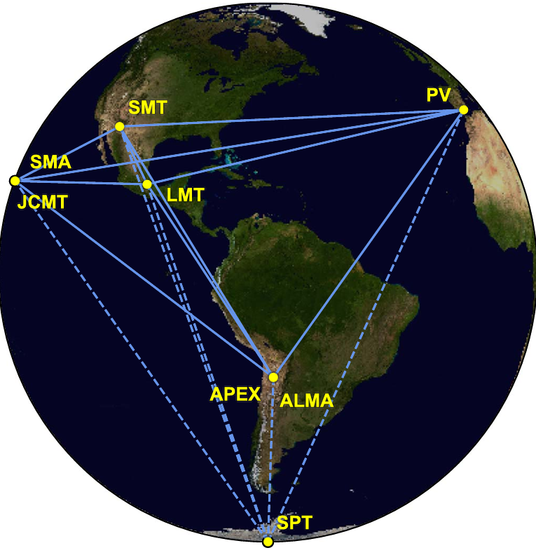
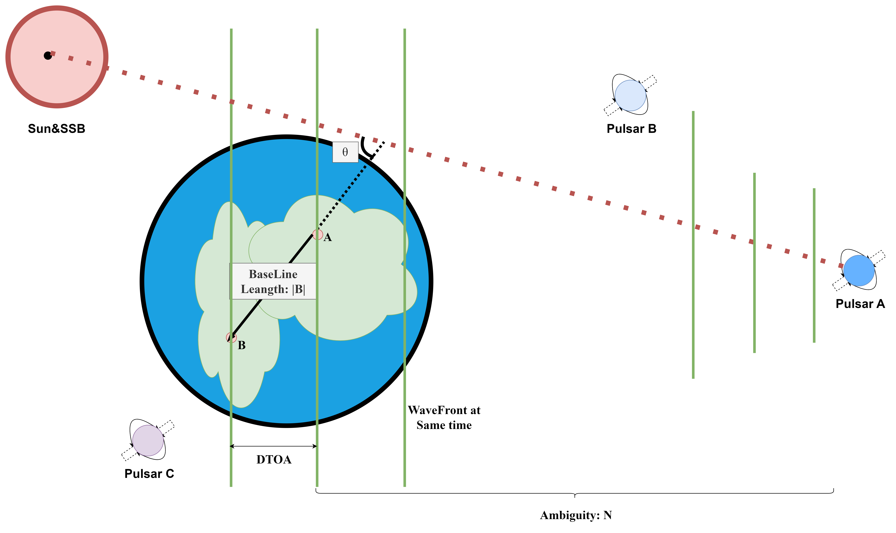
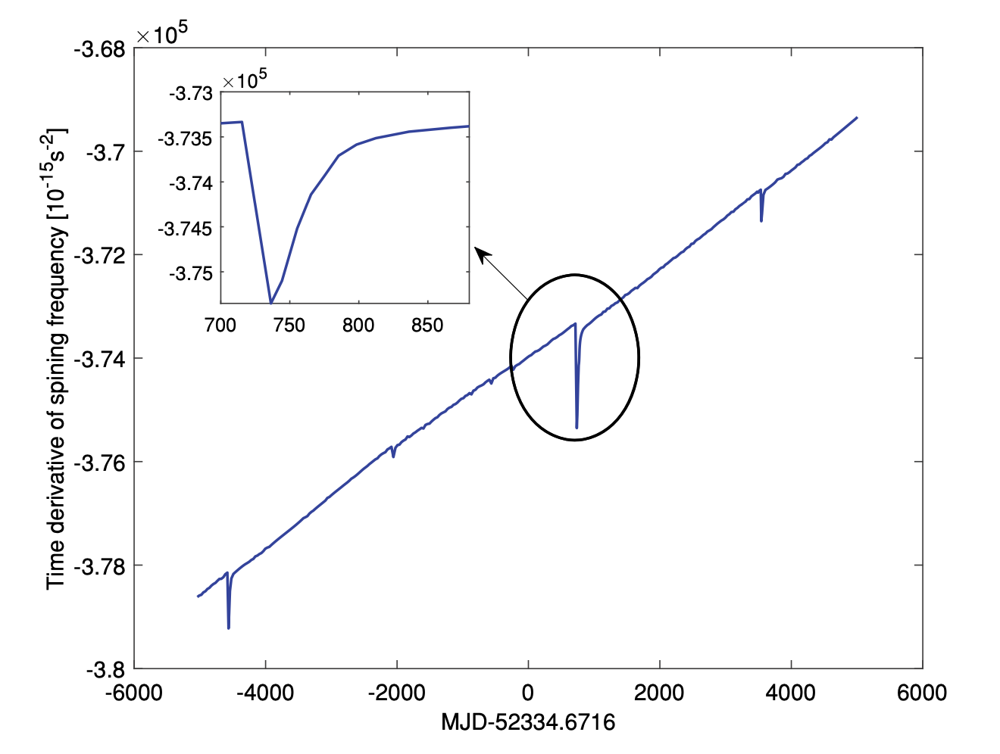

# System Design and Principles
> PanZhiQing

## 1. Principles

### 1.1. Very Long Baseline Interferometry (VLBI)

若我们使用口径为 $D$ 的望远镜来观测波长为 $\lambda$ 的电磁波，那么望远镜的角分辨率可以用如下公式来估算：

$$
\theta^N = \frac{\lambda}{D}\rho^N \tag*{(1)}
$$

我们可以发现，望远镜的角分辨率与波长成反比，与口径成正比，即在观测的电磁波波长不变的情况下，仪器的口径越大，其角分辨越小，分辨能力越高。这也解释了用于观测无线电波的射电天文望远镜动辄几十米到几百米的口径的原因。同时，假设我们选择波长较短的电磁波作为观测对象，例如X射线、伽马射线等，那么我们就可以使用相对较小的望远镜口径实现较高的角分辨率，这也是采用X射线来观测脉冲星（Pulsar）的原因。但是，X射线在大气中传播时会遭遇严重的衰减，甚至可以认为大气层对于宇宙空间发射的X射线是不透明的，因此我们只能在大气层以外的空间中观测X射线辐射，这也是空间天文卫星被用于X射线天文学的原因。

干涉测量技术是一种通过测量两个或多个波源之间的相位差来确定波源位置的技术。若我们使用相隔甚远的两架望远镜观察同一个天体，并使用干涉测量技术来测量两个射电望远镜接收到的电磁波的相位差，那么我们就可以通过这种方式来测量天体的位置或是进行成像[@10.1093/mnras/118.3.276]，理论上讲只要两架射电望远镜相距足够远我们就可以得到一个角分辨率足够优秀的“虚拟”望远镜。常规的做法是使用线缆链接两个望远镜以进行时间同步，但是过长的线缆传输过程往往会带来极大的误差，导致干涉测量的精度随着基线长度的增加而下降。

为了解决这个问题，VLBI技术[@SCHUH201268]应运而生。VLBI技术采用原子钟（一般为氢原子钟）产生时间戳，并将观测值连同时间戳一并记录在存储介质上，然后集中进行数据后处理。由于两台原子钟可以保证严格意义上的时间同步，因此就不需要使用电缆来进行时间同步。

然而，这种做法至少存在两个瓶颈：一者，地球直径有限，即使我们分别在南北两极架设望远镜，基线长度也不会超过地球直径，我们能得到的理论最高分辨率也是有限的；二者，这种做法实时性不足，我们需要等到所有数据都收集完毕后才能进行数据处理，这对于一些需要实时观测的天文现象来说是不可接受的。对于第一点，已经有国家提出了在宇宙空间中部署望远镜并与地面射电望远镜组成VLBI观测网络的方案。对于第二点，可以借助现代通信基础设施及云计算技术来实现实时数据处理。

2019年人们使用Event Horizon Telescope（EHT）[@Akiyama_2019]对黑洞进行成像，这是VLBI技术的一个成功应用。EHT 是一个由全球多组射电望远镜基线组成的VLBI同步观测网络，其等效口径几乎达到了地球的直径。

综上，Very Long Baseline Interferometry 可以以极高的分辨率观测宇宙空间中的天体，为人类提供从未有过的丰富信息。我们完全可以基于VLBI技术及在此基础之上发展而来的超高分辨率宇宙观测系统来获取目前技术条件下最为精确的宇宙空间信息数据库，该数据库记录了宇宙空间中的天体的形态、光谱、运动规律及相对于太阳系质心（SSB）的位置等信息。在接下来的内容中，我们认为该数据库已经搭载在目标上，并且目标可以随时读取并更新该数据库。

### 1.2. VLBI Observables and Data Processing
VLBI 本质上测量的是发射源同一时刻辐射出的电磁波到达基线两端的时间差（DTOA）及其变化率，通过观测多个发射源，即可计算出基线向量的空间坐标并确定发射源的位置（相对于 solar system barycenter (SSB)）。我们假设电磁波波前到达基线两端的时间差为 $\tau_g$，则有：

$$
\tau_g = \frac{1}{c} |b| \cos \theta \tag*{(2)}
$$

其中，c为光速，|b|为基线长度，$\theta$为基线与发射源方向的夹角。由于发射源距离相当遥远，我们将波前面视作平面波。此外，由于信号源初始状态未知，所以会存在模糊度N，我们有：

$$
c\tau = N \lambda + \Delta \lambda \tag*{(3)}
$$

在实际观测中由于设备限制，我们无法直接观测到 $\tau_g$，我们只能通过一些信号及数据处理方法估算出 $\tau_g$，例如最小二乘法[@Ghaderpour_2021]，傅里叶变换[@10.1093/mnras/118.3.276]等。

我们可以将观测方程线性化，以便进行最小二乘估计或卡尔曼滤波等数据处理方法。VLBI基本观测方程可以表示为：

$$
O_t = C(X,t) + V_t \tag*{(4)}
$$

其中，$O_t$为观测值包括DTOA及其变化率，$C(X,t)$为模型预测值，$V_t$为观测误差。将其线性化，我们有：

$$
Y = Ax + V \tag*{(5)}
$$

若设权系数矩阵为 $P$，则有最小二乘估计为：

$$
\hat{x} = (A^T P A)^{-1} A^T P Y \tag*{(6)}
$$

其中，$A$为偏导数矩阵，$Y$为观测值，$P$为权系数矩阵。

考虑到VLBI的DTOA观测量精度大约为氢原子钟记时精度的千分之一，即约为 $10^{-11}$ 秒，而相对论效应主要作用于光速，即约为 $10^{-8}$ 秒，因此我们必须要考虑修正相对论效应带来的误差（如太阴、地球及木星引力带来的误差）。同时，对于这种高精度观测活动，我们还需要考虑天文望远镜观测站当地的大气、潮汐、固体潮、地球自转等因素带来的误差，这与GPS高精度定位所需要处理的误差相类似。

基于上述原理，我们可以在地球上建立一个VLBI观测网络，通过观测多个发射源，我们可以计算出基线向量的空间坐标并确定发射源的位置（相对于 solar system barycenter (SSB)）。我们可以将这些观测数据存储在数据库中，以便后续的数据处理及分析，例如我们可以将其搭载在宇宙飞船上，以便在宇宙空间中进行定位及导航[@Nothnagel2017]。

### 1.3. Pulsar and XNAV(X-ray Pulsar Navigation)

脉冲星最早于1967年由剑桥大学卡文迪许实验室的安东尼·休伊什（Antony Hewish）教授的研究生——24岁的乔丝琳·贝尔·伯奈尔（Jocelyn Bell Burnell）检测射电望远镜收到的信号时无意中发现。脉冲星是一种极其致密、高度磁化、高速旋转的星体，通常为中子星或白矮星，由于其高度磁化所以会从特定方向发射出高能电磁波，同时由于其高速旋转，这些电磁波会以脉冲的形式被遥远的观测者检测到。目前检测脉冲星的方式主要分为两种，一种是前文介绍的VLBI技术中用到的，接收微波信号的射电望远镜，这类接受终端往往十分巨大，并不适合装载在小型飞船上；另一种是接收X射线信号的望远镜，由于X射线波长远远小于微波波长，因此我们可以使用装载在小型航天器上的望远镜来观测脉冲星，例如XPNAV-1 Mission[@https://doi.org/10.1155/2017/8561830]。

脉冲星的脉冲周期极短，通常为毫秒到秒级别，且极其稳定，有些脉冲星的脉冲周期甚至比原子钟还要准确[@1997A&A]。脉冲星凭借其稳定的脉冲周期及极高的角分辨率成为了天文导航的理想选择，也是超高能宇宙射线源的候选者之一。每一个脉冲星都有自己独特的信号模型[@ray2017characterizationpulsarsourcesxray]，这个模型可以用来识别不同的脉冲星。脉冲星的信号频率并非总是稳定，会存在一些随机的变化，年轻的脉冲星尤甚。所以，脉冲星导航系统，至少需要包含两个部分，一个是带有异常值监测的信号监测系统，另一个是脉冲星数据库。

目前，对于基于X射线脉冲星的太空导航，只需一天的观测数据（来自一个小型机载 X 射线探测器），就能获得精度约为 150 公里左右的航天器的三维位置[@1981tdar]。传统的基于地球深空观测网络的宇宙空间导航技术（如通过角度测量来确定坐标）会随着航天器与地球的距离增加而精度下降，而利用 X 射线脉冲星进行导航则不依赖于航天器与地球的距离，精度不会随之降低。距离地球大于 5 天文单位的深空导航，采用 X 射线脉冲星导航技术的精度优势就会显现出来。这种结合了X射线脉冲星观测数据及航天器inertial navigation system (INS)的导航系统，我们称之为XNAV。XNAV技术的优势在于其自主性增强，减少了对于地面控制的频繁依赖，降低了任务的运营成本。同时得益于X射线仪器的小型化与紧凑化，XNAV技术可以被广泛、低成本地应用于深空探测任务中，如水星、火星等行星探测任务。使用脉冲星 PSR B1937+21，航天器在距离最大可达 30 天文单位的范围内，经过 10 小时的观察，可以实现约 2 公里精度的定位，经过 1 小时的观察则为 5 公里精度。[@Shemar2016]

## 2. System Design
### 2.1. System Architecture
我们的系统由三个部分组成：VLBI观测网络、脉冲星数据库及XNAV系统。VLBI观测网络负责观测天体的位置，脉冲星数据库负责存储脉冲星的信号模型，XNAV系统负责实时定位航天器。VLBI观测网络与脉冲星数据库之间通过数据传输系统进行数据交换，脉冲星数据库与XNAV系统之间通过数据传输系统进行数据交换。

### 2.2. Pulse Star Database

## References

<!-- pandoc zn.md --citeproc --csl=apa.csl -o zn.docx -->
<!-- https://www.bruot.org/ris2bib/ -->

