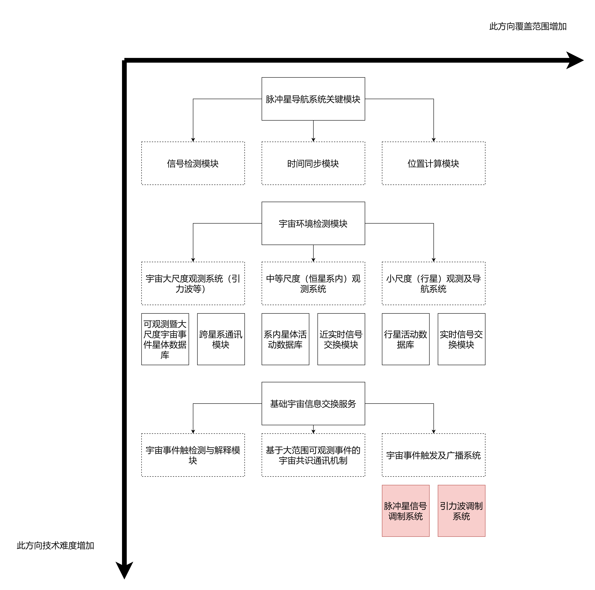

【脉冲星导航的原则】
脉冲星导航的核心原则依赖于脉冲星发射的规律性。脉冲星以极高的精度发射周期性的电磁辐射脉冲，通常在微秒或甚至纳秒的量级。脉冲星导航的基本方法包括：[7]
1.	信号检测：航天器上的接收器检测到脉冲星在太空中旅行时发出的脉冲信号。
2.	飞行时间测量：测量脉冲从脉冲星到航天器的旅行时间。这类似于全球导航卫星系统（GNSS）的原理，即通过使用信号从卫星到接收器的旅行时间来计算距离。
3.	三角测量：通过比较多个脉冲星的旅行时间，航天器可以确定其相对于每个脉冲星的位置，通常需要至少三个脉冲星的测量数据来计算三维位置。
导航系统的准确性取决于航天器能多精确测量信号飞行时间的能力，通常通过航天器上的高精度时钟实现这一目标。

脉冲星导航三个主要模块
- 信号检测模块
- 时间同步模块
- 位置计算模块

Three main modules of pulsar navigation
- Signal detection module
- Time synchronization module
- Position calculation module

