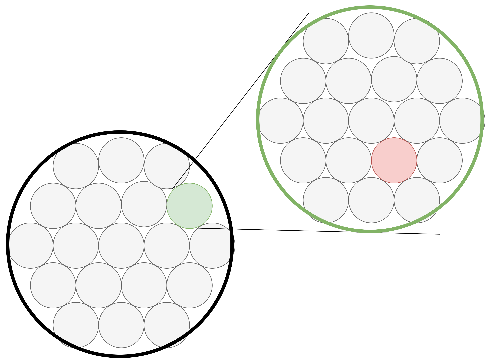
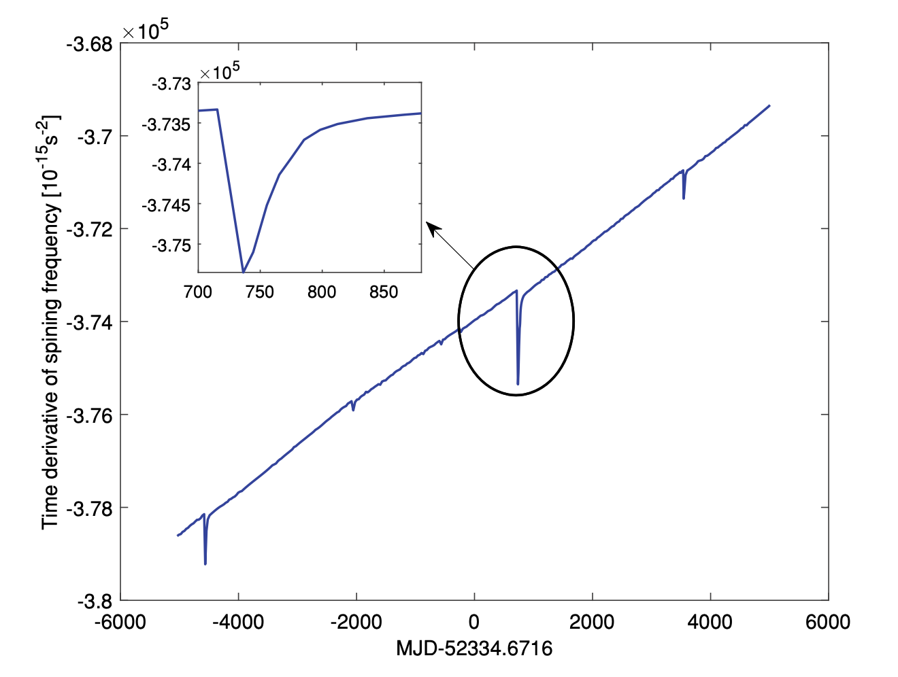

# System Desigh
> PanZhiQing | 2024-11-11 23:00

## 0. 背景及引入
> - 1 l.y = 9.461e+12 km = 9.461e+15 m = 63240 AU

比邻星距离地球约**4.24光年**，即 268,137 AU，是距离我们最近的恒星系统。假设我们以目前最快的无人探测器（如“旅行者1号”约17 km/s）的速度，并考虑加速和减速操作来完成前往比邻星的旅程，可以进行以下估算。旅行者1号的速度为**17 km/s**，约为**0.000057倍光速**。不考虑加速和减速的理想情况下，前往比邻星的时间计算如下：

$$ T = \frac{4.24 l.y}{0.000057 c} \approx 74,386 y $$

其中，$l.y$表示光年，$c$表示光速，$y$表示年。

这意味着仅保持目前的速度不变，就需要**约74,000年**才能抵达比邻星，在这样长的航程中，如何提供可靠的定位和授时服务，是一个极具挑战性的问题。现在假设我们从比邻星出发，那么在最终进入太阳系时，最大允许误差可以做如下估算。

从空间角度来讲，太阳系八大行星大致位于半径 100 天文单位的球体内。**比邻星到太阳系的距离**：4.24 光年 ≈ 268,137 AU。**太阳系行星分布的范围**：太阳系八大行星主要分布在距太阳 100 AU 以内的球体中。为了确保进入太阳系且不与八大行星擦肩而过，我们可以假设目标精度是使得误差不超过 100 AU 的范围，即最终到达太阳系时的允许偏差半径。

$$
\Delta\theta = \frac{\delta}{r} = \frac{100 AU}{268137 AU} \approx 3.73 \times 10^{-4} rad = 76.9 arcsec
$$

Where: $\Delta\theta$ is the angular deviation, $\delta$ is the deviation distance, $r$ is the distance from the target.

**我们需要在抵达太阳系附近时将定位精度控制在约 76.9 角秒以内，或者约 $3.73 \times 10^{-4}$ 弧度，以保证进入太阳系的行星分布范围内。**

注意，这样的定位精度并非总是需要，在航程的初期阶段只需要保持一个大致的方向即可，但在接近目标时，定位精度就变得至关重要。因此，我们需要一个系统，能够在整个航程中提供不同精度的定位服务，以满足不同阶段的需求。类似于瓦片地图，随着航程的推进，我们需要逐渐细化定位精度，以确保探测器能够准确进入目标星系。

## 1. 系统框架

The X-ray pulsar-based spacecraft positioning system mainly consists of an X-ray detector, spacecraft-borne atomic clock, spacecraft-borne computational device, nav- igation model algorithms database and pulsar model database. The workflow of the whole system is given in Fig.

## 原理

X射线脉冲星导航的基本原理是通过比较航天器接收到的脉冲信号到达时间（TOA）和太阳系质心（SSB）接收到的同一脉冲信号的预测到达时间来确定航天器的位置。通过测量和预测的脉冲到达时间的差异，可以反映航天器相对于SSB的距离。当同时观测到三个或更多的脉冲星时，可以通过非线性最小二乘算法几何地确定航天器的位置。

1. 时间传输模型
由于太阳系是一个黎曼空间，测量到的TOA和预测的TOA之间的关系必须考虑广义相对论效应。时间传输模型考虑了年视差、罗默延迟、色散延迟和夏皮罗时间延迟等效应。假设脉冲到达探测器的时间为 ( t_{sc} )，到达真空SSB的时间为 ( t_{SSB} )，相应的时间传输模型可以表示为：

$$ 
t_{SSB} = t_{sc} + \Delta t_{parallax} + \Delta t_{Roemer} + \Delta t_{dispersion} + \Delta t_{Shapiro}
$$

1. 航天器定位
通过比较航天器接收到的脉冲信号到达时间和SSB接收到的同一脉冲信号的预测到达时间，可以确定航天器的位置。假设同时观测到N个脉冲星，测量模型可以表示为矩阵形式：

$$ \mathbf{y} = \mathbf{H} \mathbf{x} + \mathbf{v} $$

其中，(\mathbf{y}) 是测量向量，(\mathbf{H}) 是观测矩阵，(\mathbf{x}) 是状态向量，(\mathbf{v}) 是测量噪声。

4. 非线性滤波
当考虑航天器的轨道动力学时，可以通过非线性滤波方法（如扩展卡尔曼滤波和无迹卡尔曼滤波）以及顺序观测脉冲星来确定位置。

5. 脉冲信号的整数模糊性
脉冲信号的整数模糊性是指由于脉冲周期的整数倍导致的测量不确定性。除非航天器在太阳系中“完全迷失”并且不知道任何关于自身的信息，否则航天器可以通过地面站或其他导航手段获得相对准确的初始状态。因此，在X射线脉冲星导航的测量模型中，可以忽略脉冲信号的整数模糊性。

$$
Z = h(r) + \upsilon
$$

- Z 是一个列向量，表示测量值
- h(r) 是一个列向量，表示位置相关的函数
- υ 是测量噪声，可以建模为零均值高斯白噪声，与观测持续时间、传感器的性能和环境条件有关。

从公式 (2.50) 的直观分析来看，X射线脉冲星导航的测量模型涉及脉冲信号的整数模糊性。除非航天器在太阳系中“完全迷失”，并且对自身没有任何信息，否则航天器可以通过地面站或其他导航手段获得相对准确的初始状态。毫秒脉冲星的最小旋转周期为1毫秒，对应的光行程距离约为300公里。此外，当前的导航手段大多提供优于300公里的初始导航解。此外，在一个脉冲星观测周期内，航天器的轨道动力学传播精度远高于300公里。因此，在X射线脉冲星导航的测量模型中，可以忽略脉冲信号的整数模糊性。

脉冲星信号处理
由于脉冲星信号非常微弱，航天器通常只能记录一系列光子的到达时间（TOAs），而无法记录连续的脉冲信号。目前，对脉冲星信号处理的研究主要集中在周期搜索和从记录的光子TOAs中提取脉冲到达时间（Pulse TOA）。

1. 周期搜索
周期搜索的目的是找到脉冲星信号的周期，这对于恢复脉冲星的轮廓非常重要。由于光子TOAs记录的不均匀性，无法直接使用经典的傅里叶变换来找到周期。因此，针对不均匀采样问题的周期搜索算法有着长久的研究历史，如Lomb-Scargle周期图、字符串长度法、自相关法、相位离散最小化、方差分析和信息论方法等。

2. 脉冲TOA计算方法
当假设航天器静止或做匀速线性运动时，有两种脉冲TOA的计算方法：

历元折叠法：

通过历元折叠恢复一个经验轮廓。

使用交叉相关法、自适应滤波、非线性最小二乘算法和快速接近最大似然估计算法等方法估计初始相位。

将估计的初始相位与脉冲星信号的周期相除以获得脉冲TOA。

如果脉冲星信号的周期不准确，必须通过上述周期搜索方法找到它。

直接使用光子TOAs法：

通过最大化基于光子TOAs统计特性推导的对数似然函数来执行。

3. 轨道航天器的相位跟踪算法
Golshan等人提出了一种相位跟踪算法来估计脉冲TOA和时变频率。该方法将航天器的轨道近似为分段和常量模型，确保每一段内的频率近似为常量。然后，通过成熟的方法可以容易地估计每一段的脉冲TOA和频率。最后，使用数字锁相环（DPLL）跟踪段内变化的频率。DPLL可以进一步修改为二维卡尔曼滤波器以应对DPLL内的噪声。

这种相位跟踪算法适用于像PSR B0531+21这样的年轻脉冲星，但在应用于微弱脉冲星时效果不佳。为了验证X射线脉冲星导航（XPNAV）的微弱脉冲星，我们修改了脉冲星信号的传播模型，将其表示为航天器位置的一项，并利用航天器的轨道动力学信息线性化传播模型。与之前的相位跟踪算法相比，该方法不将航天器轨道近似为分段和常量模型，从而更好地利用了微弱脉冲星。
### 1.1 时空框架

重力场与相对论效应
- gravitational environment 
- correcting time delay caused by the geometrical and general relativistic effect.

The X-ray pulsar-based navigation method works by comparing the pulse TOA at the spacecraft and that at the SSB. As the solar system is a Riemannian space, the relationship between the measured and the predicted TOA has to consider the general relativistic effect.

### X-Ray Pulsar-Based Spacecraft Time Keeping

### Traditional Celestial Measurement Model
The so-called stellar angle measurement refers to the angle between the direction vector of a reference planet and of a star with respect to the satellite.

## 2. 脉冲星的特性

## 3. 特殊的应用环境（宇宙尺度）

此方向覆盖范围增加
This direction covers a wider range of applications

此方向技术难度增加
The technical difficulty of this direction has increased

脉冲星导航系统关键模块
The key modules of the pulsar navigation system

信号检测模块
Signal detection module

时间同步模块
Time synchronization module

位置计算模块
Position calculation module

宇宙环境检测模块
Cosmic environment detection module

宇宙大尺度观测系统（引力波等）
Cosmic large-scale observation system (gravitational waves, etc.)

可观测大尺度宇宙事件数据库
Observable large-scale cosmic event database

跨星系通讯模块
Interstellar communication module

中等尺度（恒星系内）观测系统
Medium-scale (within the star system) observation system

系内星体活动数据库
Intra-system stellar activity database

近实时信号交换模块
Near real-time signal exchange module

小尺度（行星）观测及导航系统
Small-scale (planetary) observation and navigation system

行星活动数据库
Planetary activity database

实时信号交换模块
Real-time signal exchange module

基础宇宙信息交换服务
Basic cosmic information exchange service

宇宙事件检测与解释模块
Cosmic event detection and interpretation module

基于大范围可观测事件的宇宙共识通讯机制
Cosmic consensus communication mechanism based on large-scale observable events

宇宙事件触发及广播系统
Cosmic event triggering and broadcasting system

脉冲星信号调制系统
Pulsar signal modulation system

引力波调制系统
Gravitational wave modulation system