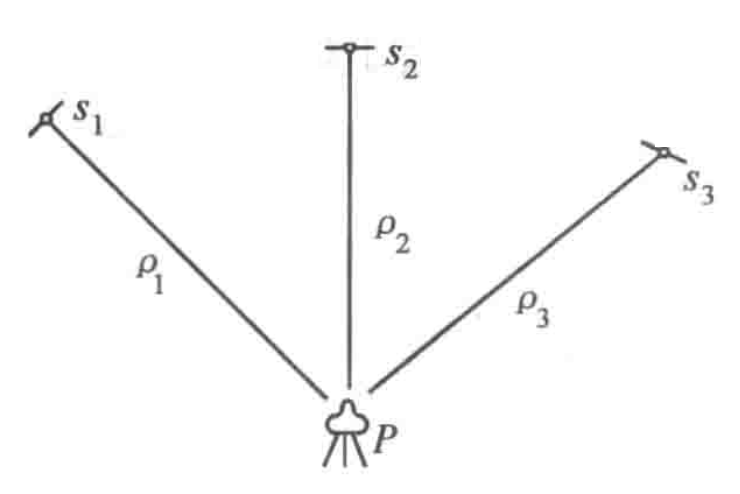
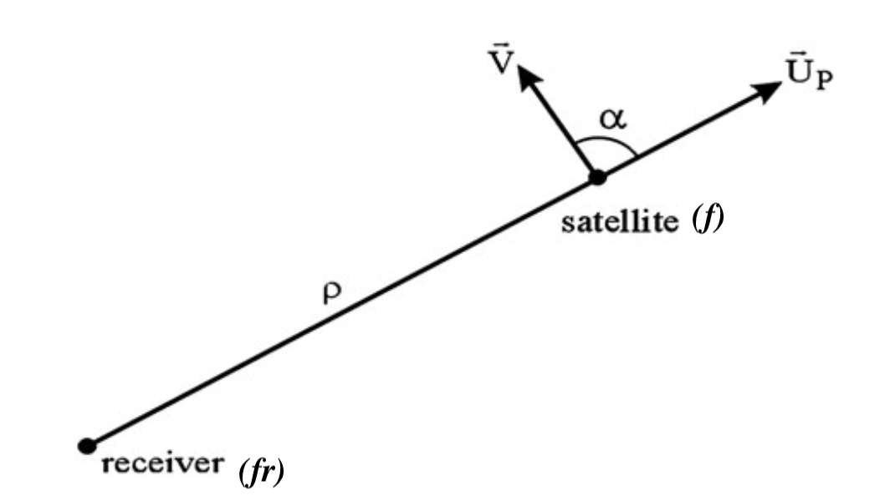

# Report 1 (20%) : 
> - PanZhiQing 24037665g

> Submission date: 18 Oct

- GPS Positioning algorithms
    - GPS observation Equations
- Pseudorange, carrier phase, and Doppler
    - GPS orbit coordinate computation and satellite clock error algorithms
    - Receiver positioning algorithms with Pseuorange Measurements

## Abstract

## Contents

- [Report 1 (20%) :](#report-1-20-)
  - [Abstract](#abstract)
  - [Contents](#contents)
  - [1. GPS observation Equations](#1-gps-observation-equations)
  - [2. GPS orbit coordinate computation](#2-gps-orbit-coordinate-computation)
    - [2.1 GPS Broadcast Ephemerides and Precise Ephemerides](#21-gps-broadcast-ephemerides-and-precise-ephemerides)
    - [2.2 Steps for GPS Satellite Oribit Position Computation](#22-steps-for-gps-satellite-oribit-position-computation)
  - [3. Satellite clock error algorithms](#3-satellite-clock-error-algorithms)
  - [4. Receiver positioning algorithms with Pseuorange Measurements](#4-receiver-positioning-algorithms-with-pseuorange-measurements)
    - [4.1 Pseudorange Model](#41-pseudorange-model)
    - [4.2 Carrier phase](#42-carrier-phase)
    - [4.3 Doppler Measurements](#43-doppler-measurements)
    - [4.4 Receiver positioning algorithms](#44-receiver-positioning-algorithms)
      - [Static Absolute Positioning(Single Point Positioning)](#static-absolute-positioningsingle-point-positioning)
      - [Static Relative Positioning(Static Differential Positioning)](#static-relative-positioningstatic-differential-positioning)
  - [References](#references)

## 1. GPS observation Equations

When we use radio navigation positioning, we can imagine that there are three known radio signal transmitters on the ground. The receiver can measure the distance from the receiver to the three transmitters($d_1, d_2, d_3$) at a certain time. Three positioning spheres can be drawn with the three transmitters as the centers and $d_1, d_2, d_3$ as the radii. 

<!--  -->

Figure 1.1. Radio navigation positioning principle 3 known points

Now, the satellite navigation positioning system obeys the same principle. We can concentrate the satellite's position by using three or more known points on the ground (control stations). Conversely, we can concentrate the position of an unknown point on the ground (user receiver) by using the known spatial positions of three or more satellites. By the way, the information about the satellite's position is transmitted to the user receiver by the satellite's broadcast ephemerides, and we will discuss this in the next section.

At a certain time $t_i$, we can measure the distance from the receiver($P$) to three satellites($S_1, S_2, S_3$) as $\rho_1, \rho_2, \rho_3$. The satellite's broadcast ephemerides give us the three satellites' positions in the ECSF coordinate system ($X^j, Y^j, Z^j \quad j = 1, 2, 3$). The receiver's position is $X, Y, Z$. GPS observation Equations can be written as:

$$ \begin{align*}
\rho_1^2 &= (X - X^1)^2 + (Y - Y^1)^2 + (Z - Z^1)^2 \tag{1.1} \\
\rho_2^2 &= (X - X^2)^2 + (Y - Y^2)^2 + (Z - Z^2)^2 \tag{1.2} \\
\rho_3^2 &= (X - X^3)^2 + (Y - Y^3)^2 + (Z - Z^3)^2 \tag{1.3} \\
\end{align*} $$

Solve this equation to get the receiver's position $X, Y, Z$. But the above equations do not consider the satellite clock error, the receiver clock error, and the ionospheric and tropospheric delays. If we consider the clock error($\delta t_k$)as a kind of unknown parameter, we need at least four satellites to solve the receiver's position.

$$
[(X^j_s - X)^2 + (Y^j_s - Y)^2 + (Z^j_s - Z)^2]^{\frac{1}{2}} - c \delta t_k = \rho'^j + \delta \rho_1^j + \delta \rho_2^j - c\delta t^j \quad j = 1, 2, 3, 4... \tag{1.4}
$$

where $X^j_s, Y^j_s, Z^j_s$ are the satellite's position in the ECSF coordinate system, $c$ is the speed of light, $\delta \rho_1^j, \delta \rho_2^j$ are the ionospheric and tropospheric delays, and $\delta t_k$ is the clock error. $\rho'^j$ is the pseudorange measurement, and we will discuss this in the next section 4.

## 2. GPS orbit coordinate computation

GPS positioning is based on the position of GPS satellites. As a result, any GPS positioning algorithm should first confirm the position of the GPS satellites before it can calculate the target location. 

In space, the position of satellites is determined using the ECSF coordinate system. The ECSF (Earth-Centered, Earth-Fixed) coordinate system is an inertial coordinate system, which is a valid system for representing the Keplerian motion of satellites in the vicinity of the Earth. The origin, O (0,0,0), is at the Earth's center of mass. The z-axis is parallel to the Earth's rotational axis and points towards the North Pole. The x-axis points towards the intersection of the Prime Meridian and the Equator. The y-axis is perpendicular to the xOz plane (i.e., it points towards the intersection of 90 degrees East longitude and the Equator), forming a right-handed coordinate system.

GPS satellite motion can be represented as a type of Keplerian motion with perturbations(disturbed satellite motion). The perturbations are caused by the gravitational forces of many factors, such as the Earth's non-spherical shape, the gravitational forces of the Sun and the Moon, and the atmospheric drag.

For engineering purposes, the satellite's orbit can be described as follows:

$$ r = r_0 + \Delta r \tag{2.1} $$

where $ r $ is the satellite's position vector(in ECSF), $ r_0 $ is the unperturbed motion, and $ \Delta r $ is the perturbed motion. 

### 2.1 GPS Broadcast Ephemerides and Precise Ephemerides
The predicted orbits are curve fitted to a set of relatively simple disturbed Keplerian elements and transmitted to the users. Similar to weather forecasts, GPS Broadcast Ephemerides cannot guarantee very high precision. 

At any given time, the satellite transmits the following parameters to the user in the form of Broadcast Ephemerides:

- SV-id : satellite number 
- $t_c$ : reference epoch of the satellite clock 
- $a_0, a_1, a_2$ : polynomial coefficients of the clock error 
- $t_{oe}$ : reference epoch of the ephemerides 
- $\sqrt{a}$ : square root of the semimajor axis of the orbital ellipse 
- $e$ : numerical eccentricity of the ellipse 
- $M_0$ : mean anomaly at the reference epoch te 
- $ω_0$ : argument of perigee 
- $i_0$ : inclination of the orbital plane 
- $Ω_0$ : longitude of the ascending node at the weekly epoch 
- $Δ_n$ : mean motion difference 
- $\dot{I}$ : rate of inclination angle 
- $\dot{\Omega}$ : rate of node’s right ascension 
- $C_{uc}, C_{us}$ : correction coefficients (of argument of latitude) 
- $C_{rc}, C_{rs}$ : correction coefficients (of geocentric distance) 
- $C_{ic}, C_{is}$ : correction coefficients (of inclination) 

In this table, we have one reference epoch for the satellite clock ($t_c$) and another for the ephemerides ($t_{oe}$), six orbital elements ($\sqrt{a}, e, M_0, ω_0, i_0, Ω_0$), and nine correction coefficients ($Δ_n, idot, \dot{\Omega}, C_{uc}, C_{us}, C_{rc}, C_{rs}, C_{ic}, C_{is}$).

Consistent observation and systematic adjustment of the GPS satellites can correct the uncertainty of the Broadcast Ephemerides, resulting in what is called Precise Ephemerides. They can be downloaded for free from several internet homepages (e.g., www.gfz-potsdam.de).

### 2.2 Steps for GPS Satellite Oribit Position Computation

For observation time $t'$, the satellite's position can be calculated as follows:

1. Calculate the mean motion of the satellite $n$:
    $$ n = \sqrt{\frac μ {a^3} } + \Delta n \tag{2.1} $$

    where $μ = 3.986005 × 10^{14} m^3/s^2$ [$^{[2]}$](http://www.braeunig.us/space/constant.htm) is the Earth's gravitational constant, and $a$ is the semimajor axis of the orbital ellipse. The $\Delta n$ term is the mean motion difference transmitted by the satellite.

2. Calculate the $t_k$ time elapsed since the reference epoch $t_{oe}$:
    $$ \Delta t = a_0 + a_1(t' - t_c) + a_2(t' - t_c)^2 \tag{2.2} $$
    $$ t_k = t' - \Delta t - t_{oe} \tag{2.3} $$
    We call $t_k$ the time elapsed since the reference epoch $t_{oe}$.
3. Calculate the mean anomaly $M_k$:
    $$ M_k = M_0 + n t_k \tag{2.4} $$
4. Solve the Kepler equation for the eccentric anomaly $E_k$:
    $$ E_k = M_k + e \sin E_k \tag{2.5} $$
    We use the Newton-Raphson method to solve this equation. 
5. Calculate the true anomaly $v_k$:
    $$ v_k = \arctan \left( \frac{\sqrt{1 - e^2} \sin E_k}{\cos E_k - e} \right) \tag{2.6} $$
6. Calculate the argument of latitude $\Phi_k$:
    $$ \Phi_k = v_k + ω_0 \tag{2.7} $$
7. Calculate the correction terms $\delta_u, \delta_r, \delta_i$:
    $$ \delta_u = C_{us} \sin(2\Phi_k) + C_{uc} \cos(2\Phi_k) \tag{2.8} $$
    $$ \delta_r = C_{rs} \sin(2\Phi_k) + C_{rc} \cos(2\Phi_k) \tag{2.9} $$
    $$ \delta_i = C_{is} \sin(2\Phi_k) + C_{ic} \cos(2\Phi_k) \tag{2.10} $$
    we call these the argument of latitude correction, the geocentric distance correction, and the inclination correction, respectively.
8. Calculate the corrected argument $u_k, r_k, i_k$:
    $$ u_k = \Phi_k + \delta_u \tag{2.11} $$
    $$ r_k = a(1 - e \cos E_k) + \delta_r \tag{2.12} $$
    $$ i_k = i_0 + \dot{I} t_k + \delta_i \tag{2.13} $$
9. Calculate $\Omega_k$, the corrected longitude of the ascending node:
    $$ \Omega_k = Ω_0 + (\dot{\Omega} - ω_e) t_k - ω_e t_{oe} \tag{2.14} $$
    where $ω_e = 7.2921151467 × 10^{-5} rad/s$ is the Earth's angular velocity.
10. Calculate the satellite's position in the ECSF coordinate system in Linear Algebra form:
    $$ r = \begin{bmatrix} X_k \\ Y_k \\ Z_k \end{bmatrix} = \begin{bmatrix} x_k \cos \Omega_k - y_k \cos i_k \sin \Omega_k \\ x_k \sin \Omega_k + y_k \cos i_k \cos \Omega_k \\ y_k \sin i_k \end{bmatrix} \tag{2.15} $$

Now, we have the satellite's position in the ECSF coordinate system from the Broadcast Ephemerides.

## 3. Satellite clock error algorithms
As we mationed in the 2.1, $a_0, a_1, a_2$ are polynomial coefficients of the satellite clock error. More specifically, $a_0$ is the clock bias, $a_1$ is the clock drift, and $a_2$ is the acceleration of the related clock. So the satellite clock error can be calculated as follows:

$$ \delta t_k = a_0 + a_1(t' - t_c) + a_2(t' - t_c)^2 \tag{3.1} $$

where $t'$ is the observation time, $t_c$ is the reference epoch of the satellite clock.

The equation (3.1) only works for stable satellite clocks(small drift, small acceleration and stable bias). In the case of SA (selective availability), the clock bias must be modelled for every measuring epoch. 
$$ \delta t = a_{0i}, t = t_i \tag{3.2} $$

The essence of high-precision GPS positioning is high-precision time measurement, because every tiny error in time measurement can lead to a large error in distance measurement when multiplied by the speed of light. The satellite clock error can be divided into three parts:

1. When factored with the speed of light, c: This kind of clock error can lead to a distance error of $c \delta t_k$.
2. When factored with the speed of satellites: No implicit like the other two, but it can lead to a distance error of $v_s \delta t_k$.
3. When factored with the working frequency: This kind of clock error can lead to a phase error of $c \delta t_k / \lambda$.

## 4. Receiver positioning algorithms with Pseuorange Measurements

### 4.1 Pseudorange Model
GPS Pseudorange measurements are essentially calculated by measuring the time it takes for the signal to propagate from the satellite to the receiver. The reason it is called "pseudorange" is that this distance is not the true geometric distance, but a distance that includes satellite clock errors, receiver clock errors, and errors in the signal propagation process (atmospheric effects, multipath effects, etc.). The following is the derivation of the pseudorange model.

Now we assume that the time the GPS signal is transmitted from the satellite is $t_e$, and the time the signal is received by the receiver is $t_r$. In the case of a vacuum medium and no errors, the speed of light is denoted as $c$. Then the geometric distance from the satellite to the receiver (also equal to the measured pseudorange) can be expressed as:

$$ R^s_r(t_r,t_e) = c(t_r - t_e) \tag{4.1} $$

If we consider the satellite clock error $\delta t_s$ and the receiver clock error $\delta t_r$, then we have:

$$ R^s_r(t_r,t_e) = c(t_r - t_e) - c(\delta t_r - \delta t_s) \tag{4.2} $$

In the ECSF coordinate system, we assume that the satellite's position is $(X_s, Y_s, Z_s)$, and the receiver's position is $(X_r, Y_r, Z_r)$. Then we can calculate the geometric distance in the right-hand side of (4.2) as follows:

$$ \rho^s_r(t_r,t_e) = \sqrt{(X_r - X_s)^2 + (Y_r - Y_s)^2 + (Z_r - Z_s)^2} \tag{4.3} $$

If we consider the clock error correction $\delta_{ion}$, ionospheric correction $\delta_{tro}$, tropospheric correction $\delta_{tide}$, multipath effect correction $\delta_{mul}$, relativistic effect correction $\delta_{rel}$, and error $\epsilon$, then we have:

$$ R_r^s(t_r,t_e) = \rho^s_r(t_r,t_e) - c(\delta t_r - \delta t_s) + \delta_{ion} + \delta_{tro} + \delta_{tide} + \delta_{mul} + \delta_{rel} + \epsilon \tag{4.4} $$

However, considering that the height of GPS satellites is usually around 20,200 km, the time it takes for the GPS signal to reach the surface of the Earth at the speed of light is about 0.07s, and the angular velocity of the Earth's rotation is about $15 arcsec^{-1}$, the error caused by the Earth's rotation is about $0.07s \times 15 arcsec^{-1} = 1.05 arcsec$, and this error needs to consider the latitude factor of the Earth because the great circle length of different latitudes is different. In the worst case (the equator), this error will bring about 31m error, so it cannot be easily ignored.

### 4.2 Carrier phase

By measuring the carrier phase, we can obtain better positioning accuracy. However, the carrier signal is a kind of periodic and discontinuous sine signal (modulated with the ranging code and navigation message), and measuring the carrier phase itself is not enough to determine the distance. We also need to determine how many complete cycles have passed. This introduces the concept of integer ambiguity (N). Essentially, the carrier phase observation is the difference between the phase of the local oscillator in the receiver at the time the signal is received $t_r$ and the phase of the signal transmitted by the satellite $\Phi^s$, plus an integer ambiguity:

$$ \Phi_r^s = \Phi_r - \Phi^s + N_r^s \tag{4.5} $$

The phase of the signal received by the receiver at time $t_r$ is the same as the phase of the signal transmitted by the satellite at time $t_e$. If the propagation time is denoted as $\Delta t$, then we have:
$$ \Phi^s(t_r) = \Phi_e^s(t_r - \Delta t) \tag{4.6} $$

By considering the propagation time $\Delta t = \rho^s_r(t_r,t_e)/c$ and the frequency of the local oscillator in the receiver $f$, we have:

$$ \Phi_r^s = \frac{\rho^s_r(t_r,t_e)f}{c} + N_r^s \tag{4.7} $$

If we consider the clock error and other errors in the above equation, we have:

$$ \Phi_r^s = \frac{\rho^s_r(t_r,t_e)}{\lambda} - f(\delta t_r - \delta t_s) + N_r^s - \frac{\delta_{ion}}{\lambda} - \frac{\delta_{tro}}{\lambda} - \frac{\delta_{tide}}{\lambda} - \frac{\delta_{mul}}{\lambda} - \frac{\delta_{rel}}{\lambda} + \frac{\epsilon}{\lambda} \tag{4.8} $$

Another thing to note is that the integer ambiguity depends on the continuous observation of the receiver to the satellite. If the observation is interrupted, it will cause an integer jump, and only the phase observation values that are less than one week are correct.

### 4.3 Doppler Measurements

Doppler Effects refer to the frequency shift of the wave received at the receiving end due to the relative motion between the two objects (the transmitting end and the receiving end).In GPS positioning, there is also relative motion between the satellite and the receiver. We make the following discussion:

If the signal frequency $f$ is transmitted by the satellite at time $t_e$, and the signal frequency $f_r$ is received by the receiver at time $t_r$, the satellite's motion vector is $\vec{V}$, the direction vector between the satellite and the receiver is $\vec{U_p}$, and the distance between the satellite and the receiver is $\rho$, then we have:

Figure 4.1. Doppler Effects

$$ V_{\rho} = \vec{V} \cdot \vec{U_p} = \cos \alpha \cdot V \tag{4.9} $$
$$ f_r = f \left( 1 + \frac{V_{\rho}}{c} \right) \tag{4.10} $$

Known $f/c = \lambda$, so we have:

$$ f_d = f_r - f = f \left( \frac{V_{\rho}}{c} \right) = \frac{V_{\rho}}{\lambda} \tag{4.11} $$
$$ D = \frac{\mathrm{d} \rho}{\lambda \mathrm{d} t} \tag{4.12} $$

Where $D$ is the Doppler count (or integrated Doppler). We can consider the Doppler frequency shift as a by-product of the carrier phase measurement. If we take the clock error in the pseudorange model into account, we can get the Doppler frequency shift as follows:

$$ D = \frac{\mathrm{d} \rho_r^s(t_r,t_e) }{\lambda \mathrm{d} t} - f \frac{\mathrm{d} \beta}{\mathrm{d}t} + \delta f - \epsilon \tag{4.13} $$

where $\beta$ is the term of clock error ($\delta t_r –\delta t_s$), $\delta f$ is the frequency correction of the relativistic effects and $\epsilon$ is error. Effects with low frequency properties such as ionosphere, troposphere, tide, and multipath effects are cancelled out.

### 4.4 Receiver positioning algorithms

#### Static Absolute Positioning(Single Point Positioning)

#### Static Relative Positioning(Static Differential Positioning)

## References
1. GPS: Theory, Algorithms and Applications, by Guochang Xu. Springer, 2007. doi: https://doi.org/10.1007/978-3-662-50367-6
2. BASIC CONSTANTS FOR ASTRODYNAMICS, http://www.braeunig.us/space/constant.htm