# Report 2 
> - PanZhiQing24037665g

## Abstract
In this report, I will explore the development of related technologies from multiple perspectives around the topic of multipath effects. The focus of this report is the application of computer technology in multipath detection, compensation, elimination, etc. First, I will briefly introduce the basic concepts of multipath effects, and then review the methods of multipath error mitigation in recent years from the perspectives of machine learning, 3D modeling, multi-device fusion, receiver design, etc. Finally, I will provide further introductions to some important methods in the appendix, such as Convolution Neural Network, Long Short-Term Memory, Ray Tracing Algorithm, etc.

## Contents
- [Report 2](#report-2)
  - [Abstract](#abstract)
  - [Contents](#contents)
  - [1. Introduction](#1-introduction)
  - [2. Review of GNSS Multipath Error Mitigation Methods In Recent Years](#2-review-of-gnss-multipath-error-mitigation-methods-in-recent-years)
    - [2.1 Machine Learning-based Methods](#21-machine-learning-based-methods)
    - [2.2 3D Model-based Methods(3DMA GNSS)](#22-3d-model-based-methods3dma-gnss)
    - [2.3 Multi-Device Fusion Method](#23-multi-device-fusion-method)
    - [2.4 Receiver Design](#24-receiver-design)
  - [3. Conclusion](#3-conclusion)
  - [4. Appendix](#4-appendix)
    - [4.1 Convolution Neural Network (CNN)](#41-convolution-neural-network-cnn)
    - [4.2 Long Short-Term Memory (LSTM)](#42-long-short-term-memory-lstm)
    - [4.3 Ray Tracing Algorithm](#43-ray-tracing-algorithm)
  - [References](#references)

## 1. Introduction

GPS Receiver will receive GPS satellite signals reflected from the surrounding environment. Compared to the direct signal received by the receiver, these reflected signals often take longer to reach the receiver, resulting in positioning errors. This phenomenon is also known as multipath effect. In general, the receiver may receive two types of signals at the same time (direct, multipath indirect) (as shown in Figure 1).

<!-- 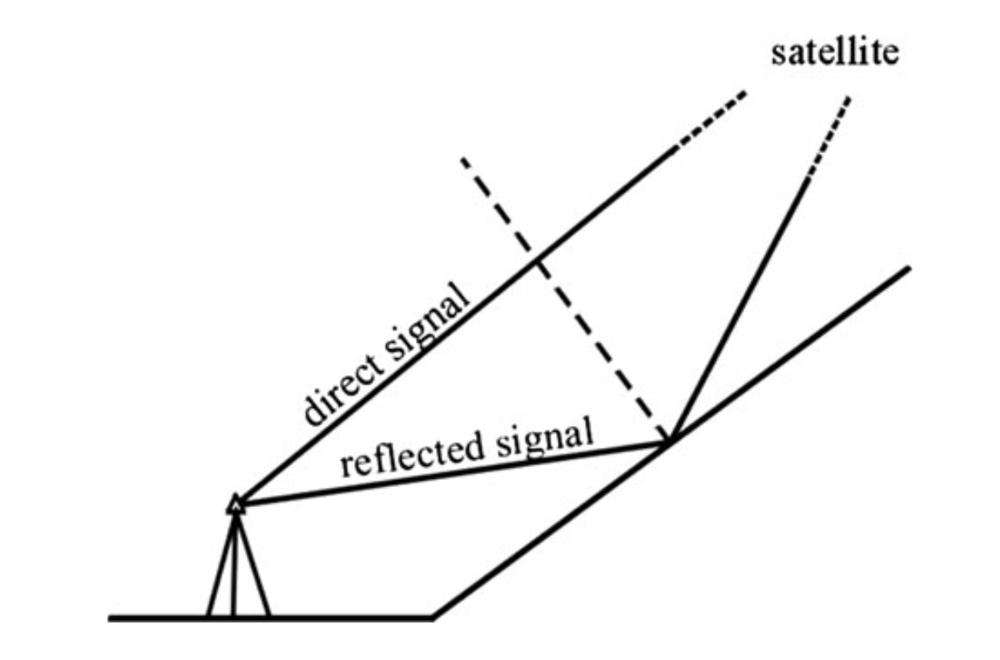 -->

Figures 1: Multipath effect on GNSS signal

As mentioned earlier, the impact of multipath effects is highly dependent on the local environment in which the receiver is located and the height of the satellite position. At the same time, the structural factors of the receiver should also be considered. Different receivers adopt different designs, so the effect of reducing multipath effects will also be different. Considering that the satellite is in motion, we can model the multipath effect as a function of time. Assuming that the signal received by the direct receiver is represented by:

$$
s(t) = A \cos(\omega t + \phi) \tag{1.1}
$$

The signal after multipath reflection is represented by:

$$
s'(t) = f \times s(t + \delta t) \tag{1.2}
$$

Where $f$ is the attenuation coefficient brought by the reflection, and $\delta t$ is the time delay.

Multipath effects essentially bring time delays, so their impact on positioning accuracy is proportional to the wavelength. For example, for P-code signals with a wavelength of about 30 meters, the impact of multipath effects is about 15 meters; for C/A signals, the wavelength is about 300 meters, and the impact of multipath effects is about 150 meters. If shorter wavelength carrier observations are used, the impact of multipath effects will be reduced to the centimeter level. Another characteristic of multipath effects is related to the GPS signal itself. The GPS signal is right-handed circularly polarized (RHCP), and the signal reflected by multipath effects will change this property. From the receiver's perspective, the signal's signal-to-noise ratio will be significantly reduced (1/3). Therefore, we can try to keep the receiver away from the reflecting surface as much as possible, or use carrier observations to mitigate the impact of multipath effects. In cases where C/A signals must be used, we can use phase-smoothed codes to reduce the impact of multipath effects.

If you want to accurately eliminate multipath effects, you need to detect the signals affected by multipath effects and weaken them. Generally, a combination of code and phase is used to detect multipath effects. Reviewing the pseudorange measurement model (Report1 4.4) and the carrier phase measurement model (Report1 4.8) in the previous report, we can derive a joint formula for detecting multipath effects:

$$
R_r^s(t_r,t_e) - \lambda \phi_r^s(t_r) = 2 \delta_{ion} + \lambda N_r^s + \delta_{mul} + \epsilon \tag{1.3}
$$

Where $R_r^s(t_r,t_e)$ is the pseudorange observation value, $\lambda \phi_r^s(t_r)$ is the carrier phase observation value, $\delta_{ion}$ is the ionospheric delay, $\lambda N_r^s$ is the integer ambiguity, $\delta_{mul}$ is the effect of multipath on code observation, and $\epsilon$ is the error of code observation. Since the error of carrier phase observation is much smaller than the error of code observation, we can detect multipath effects through carrier phase observation.

## 2. Review of GNSS Multipath Error Mitigation Methods In Recent Years

With the development of computer technology, people's ability to model the real world is also constantly improving. Compared with traditional methods based on empirical formulas, filters, etc., it is now possible to perform more detailed modeling and analysis through computers. For example, the use of machine learning algorithms to detect multipath signals in GNSS measurements has been proposed in recent years.[$^3$](#References) In addition, the use of 3D models of cities and ray-tracing techniques to detect multipath signals has also been proposed.[$^{4,5}$](#References)

### 2.1 Machine Learning-based Methods

In the past decade, machine learning algorithms have been increasingly involved in positioning-related applications, such as processing large amounts of data obtained from various complex sensors (LiDAR point clouds, high-definition photos, etc.). In general, machine learning algorithms rely on large amounts of data, especially annotated data. These algorithms first extract effective features (embedding) from the data, and then optimize the network parameters to identify these features to achieve specific tasks (classification, segmentation, and object detection, etc.). Compared with traditional algorithms based on statistics or signal processing, this data-driven method is more flexible and can adapt to different scenarios to some extent. However, there are also some problems, such as the need for a large amount of annotated data, poor interpretability of the model, and overfitting.

Machine learning algorithms can automatically model, extract, and identify features in complex datasets. The observation data of GNSS receivers is essentially a multidimensional dataset with time, space, and frequency dimensions. This multidimensional data is exactly what machine learning algorithms are good at handling. For example, the classic CNN network can extract features and classify image data. If we format the GNSS receiver data into a format similar to multi-channel image data, we can use the CNN network to identify multipath signals. Evgenii Munin et al. simulated different GNSS receiver configurations by constructing artificial signals and formatted the output two-band signals (I, Q) into two-dimensional images distributed in geographic space, and then used the CNN network to identify multipath signals. It can be found that CNN is significantly activated in the multipath signal area, thereby achieving multipath signal detection. [$^7$](#References)

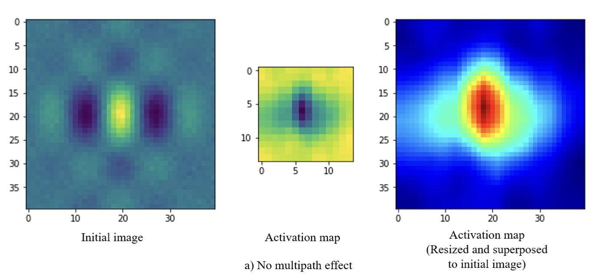
Figure 2: Activation map of CNN for multipath detection in GNSS receivers.

The machine learning-based GPS multipath detection method proposed by Kim et al. uses four features (i.e., C/N0, time difference of C/N0, difference between pseudorange time difference and pseudorange rate, satellite elevation angle) and one feature (i.e., double-difference pseudorange residual of dual antennas). The four machine learning algorithms used in the study are GBDT, Random Forest, Decision Tree, and K-Nearest Neighbor (KNN).[$^3$](#References)

Machine learning algorithms can not only effectively identify multipath effects but also predict the uncertainty of other GNSS measurements, such as GNSS satellite visibility and pseudorange error. For example, Zhang et al. used an LSTM network to predict the uncertainty of GNSS measurements.[$^{11}$](#References) Here, satellite visibility refers to whether the satellite is blocked, and pseudorange error refers to the pseudorange error caused by multipath effects. They used an FCNN network to extract features of GNSS signals and then used an LSTM network to integrate the temporal context of GNSS signals to predict satellite visibility and pseudorange error. Fully Connected Neural Networks (FCNNs) are a common neural network structure used for feature extraction and output formatting. Long Short-Term Memory (LSTM) simulates memory and forgetting processes by introducing memory units, thereby modeling time-series data.

<!-- 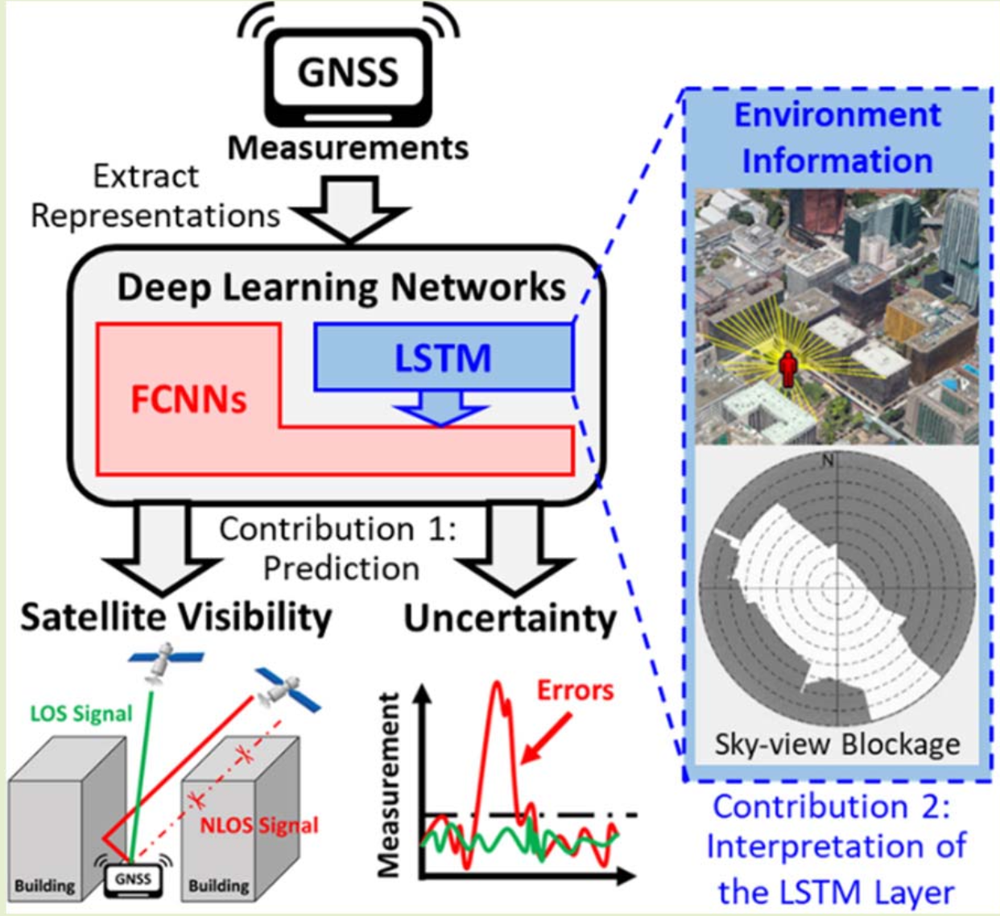 -->

Figure 3: LSTM-based GNSS measurement uncertainty prediction.

### 2.2 3D Model-based Methods(3DMA GNSS)

We mentioned earlier that multipath effects are related to the local environment of the receiver and the height of the satellite position. In other words, the impact of multipath effects can be modeled by a computer via 3D models of cities(3DMA GNSS).[$^6$](#References)

In this field, an earlier method is to detect and exclude satellites that may be affected by multipath effects through the 3D digital model of the city (e.g. shadow matching method). Subsequently, a method based on ray tracing technology was proposed to quantify the multipath effects caused by buildings in the city, which can achieve a positioning accuracy of 10m in high-rise dense areas.

The reason why it is necessary to use the 3D digital model of the city to detect multipath interference is that the power of consumer-grade GNSS receivers installed in mobile phones is insufficient to distinguish between line-of-sight (LOS) signals and typically non-line-of-sight (NLOS) signals through signal-to-noise ratio (SNR). Wang et al.[$^{12}$](#References) used a 3D building model of part of London City, combined with ephemeris data, to use the Shadow matching method to rank the received signals and only select the signals with high rankings for positioning.
<!-- 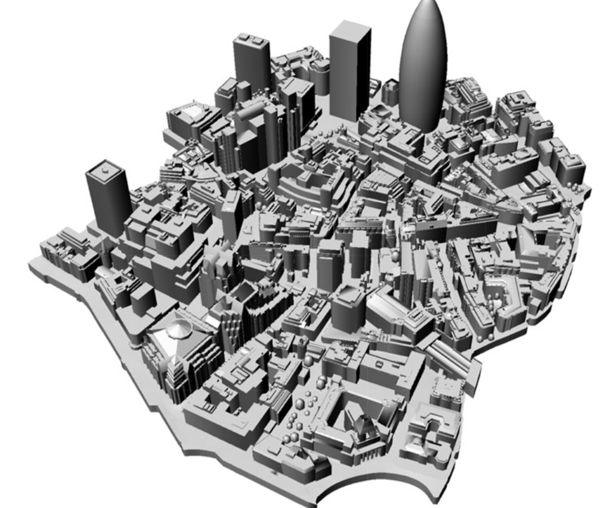 -->

Figure 4: 3D Model for London City.

The Shadow matching method they used specifically represents the building boundary as azimuth-elevation pairs, which are then projected onto the local sky plot. Combined with the satellite positions calculated from ephemeris data, an index for ranking can be constructed.

<!-- 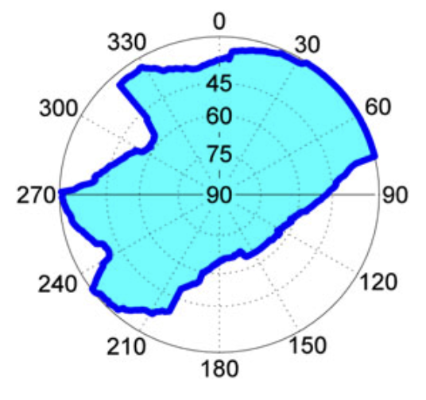 -->

Figure 5: an example of a building boundary as azimuth-elevation pairs in a sky plot. 

Through randomly selecting sampling points near the receiver (e.g., within 15m), combined with the city's digital model and ray tracing techniques, we can calculate the simulated pseudorange value of each sampling point. Combined with the real measured pseudorange, these simulated pseudoranges can be used to correct the real pseudorange observations (e.g., weighted average based on similarity) and detect outliers (e.g., multipath signals reflected two or more times).[$^5$](#References)

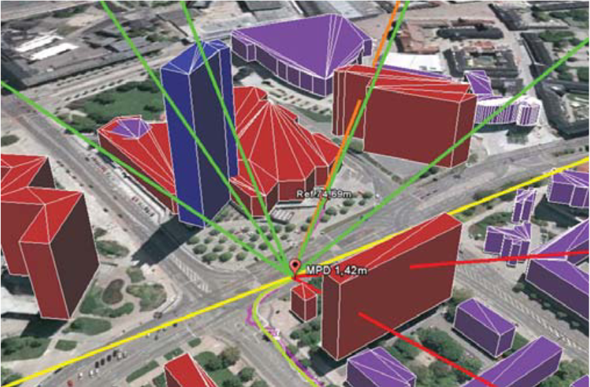

Figure 6: Multipath detection with 3D digital maps for robust multi-constellation GNSS/INS vehicle localization in urban areas.

With the gradual maturity of technologies such as autonomous driving, the digital models of the surrounding environment can also be dynamically generated through vehicle-mounted radar. This dynamic 3D map can be fully combined with the vehicle-mounted GNSS receiver to achieve real-time detection and reduction of multipath effects, thereby improving the positioning accuracy of the vehicle-mounted GNSS in urban roads.[$^9$](#References)

With the gradual growth of urban digital assets (such as city models in Google Earth), the application prospects of this technology are becoming broader. However, this technology also has several limitations, such as the three-dimensional model of a city being too large, resulting in excessive computational complexity, or the three-dimensional model of some cities not yet being established. In this case, LiDAR can be used to generate real-time 3D models of local areas.

Since the city's 3D model in Google Earth only contains static city building models, dynamic obstacles in actual city roads (e.g., double-decker buses commonly seen on Hong Kong streets) will also produce multipath effects. In this case, relying on static city building models to detect multipath effects cannot meet actual needs and may even introduce additional errors. Using LiDAR to generate real-time 3D models of city roads, combined with vehicle-mounted GNSS receivers, can achieve real-time detection of dynamic obstacles and real-time elimination of multipath effects, thereby improving the positioning accuracy of vehicle-mounted GNSS on city roads.

Weisong Wen et al. use LiDAR to obtain real-time 3D point cloud data and combine it with real-time observation data from GNSS receivers to detect and exclude satellite signals blocked by double-decker buses in real time, thereby improving the positioning accuracy of vehicle-mounted GNSS on Hong Kong city roads. Here are the specific steps:

<!--  -->

Figure 7: Real-time exclusion of GNSS NLOS receptions caused by dynamic objects in heavy traffic urban scenarios using real-time 3D point cloud.

  1. First, cluster the 3D point cloud data based on Euclidean distance and identify double-decker buses through preset parameters.
  2. Centered on the vehicle-mounted GNSS receiver, project the satellites and double-decker buses onto the Skyplot for subsequent detection of blocked satellites.
  3. Exclude satellites blocked by double-decker buses based on the elevation angle, azimuth, signal-to-noise ratio of the satellite, and boundary information of the double-decker bus (elevation angle and azimuth in the Skyplot).
  4. Use satellites excluded from NLOS for GNSS positioning.

### 2.3 Multi-Device Fusion Method

In the field of autonomous driving, location information can be obtained by fusing data from multiple sensors. For example, vehicle-mounted GNSS receivers, IMUs, LiDARs, cameras, etc. These sensor data can provide different information, such as the vehicle's position, attitude, speed, three-dimensional point cloud data of the surrounding environment, high-definition photos, etc.

Weisong Wen et al. proposed a dataset UrbanLoco based on a full sensor suite, which includes LiDAR, 360-degree view cameras, inertial measurement units (IMUs), and global navigation satellite systems (GNSS). Considering that densely built-up urban areas will significantly block GNSS signals and have associated multipath effects and NLOS problems, they evaluate the reliability of GNSS positioning by estimating the urbanization rate of a point (skyview blockage). The urbanization rate refers to the proportion of the sky blocked by buildings around a point. [$^{10}$](#References)

They use the Skymask method to generate a polar coordinate map showing the outline of buildings by combining images taken by a fisheye camera installed on the roof of the vehicle with image segmentation algorithms. The gray area in Skymask represents the sky blocked by buildings, and the white area represents the clear sky. The generation of Skymask can be based on a 3D building model or using a fisheye camera and image segmentation algorithm on the top of the vehicle. To quantitatively analyze Skymask, two parameters are further defined: the mean elevation angle of the mask (µMEA) and the standard deviation of the elevation angle of the mask (σ²MEA). They are defined as follows:

- The formula for calculating the mean elevation angle $\mu_{MEA}$ of the mask:
$$
\mu_{MEA} = \frac{1}{N} \sum_{\alpha=1}^{N} \theta_{\alpha} \tag{2.1}
$$

- The formula for calculating the standard deviation of the elevation angle of the mask $\sigma^2_{MEA}$:

$$
\sigma^2_{MEA} = \sqrt \frac{\sum_{ \alpha=1}^{N} (\theta_{\alpha} - \mu_{MEA})^2}{N-1} \tag{2.2}
$$

Where $\theta_{\alpha}$ represents the elevation angle at a specific azimuth $\alpha$, which is closely related to the building height, and $N$ represents the number of azimuths with uniform intervals from Skymask. Typically, $N$ is set to 360, which means that the resolution of the azimuth is 1 degree.

When the vehicle is in a densely built-up urban area, Skymask is usually dominated by high-rise buildings, resulting in a larger $\mu_{MEA}$ and a relatively smaller $\sigma^2_{MEA}$. In rural areas, both $\mu_{MEA}$ and $\sigma^2_{MEA}$ are relatively small. In areas with a mix of high and low buildings, $\sigma^2_{MEA}$ will be relatively large.

Through the above urbanization measurement method, the dataset evaluates the urbanization rate of the current mapping/positioning dataset. The results show that the urbanization levels of the three datasets are significantly lower than that of Hong Kong. By measuring the urbanization rate, the urbanization rate of the current positioning dataset can be evaluated, thereby evaluating the reliability of GNSS positioning. At the same time, other positioning methods, such as IMUs, LiDARs, etc., can also be selected in these areas.

### 2.4 Receiver Design

Consumer-grade GNSS antennas have low gain and less polarization discrimination. This makes it more difficult to distinguish between line-of-sight (LOS) signals and typically non-line-of-sight (NLOS) signals through signal-to-noise ratio (SNR). Therefore, antenna design is one of the key factors in eliminating multipath interference. In most cases, the direct GPS signal comes from the overhead horizontal direction, while the multipath signal comes from the lower horizontal direction; the GPS signal is right-handed circularly polarized, while the multipath signal may be left-handed circularly polarized. Therefore, under the premise of ensuring a clear view from the overhead horizontal direction, the antenna design should minimize the reception of signals from the lower horizontal direction as much as possible. In addition, side radiation and back radiation are also important sources of multipath interference.

A choke ring antenna is a directional antenna designed for reception of GNSS signals from satellites. It consists of a number of concentric conductive cylinders around a central antenna.

For example, the classic choke ring antenna, which is designed to reduce ground reflection and low-angle multipath interference. Some well-designed choke ring antennas installed in ground stations can provide millimeter-level accuracy, making GPS positioning information useful for geodetic and geophysical measurements.

Figure 8: A choke ring antenna (real photo).

Also, there are some small antenna designs, such as the Dual-Band GPS-RSW Antenna. The Dual-Band GPS-RSW Antenna is a patch antenna designed for dual-frequency GPS (L1 and L2) with reduced surface wave. It has a compact dual-layer concentric ring structure (inner and outer rings correspond to L1 and L2, respectively). This antenna performs well in the horizontal plane and back radiation, significantly reducing ground reflection and low-angle multipath interference, suitable for high-precision positioning applications.[$^2$](#References)

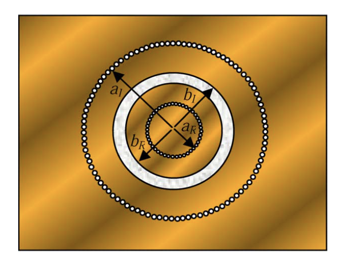

Figure 9: A dual-band reduced-surface-wave patch antenna (top view).

## 3. Conclusion

In this report, I have focused on some applications of computer technology in the GNSS field, including detecting and compensating multipath effects based on 3D models, using emerging neural networks to detect multipath effects, etc. These methods are mostly computationally intensive methods that are difficult to run directly on traditional receivers and are generally used as post-processing algorithms on computers. However, with the development of computer technology, today's smartphones can run complex 3D video games and large models smoothly (iPhone, etc.), and the performance of mobile devices is now fully capable of supporting many computationally intensive algorithms. Not to mention that many cars now come equipped with intelligent driving chips (such as Snapdragon 8155 and NVIDIA solutions), and the rich computing resources also provide the possibility for real-time operation of these algorithms.

In the field of intelligent driving, end-to-end intelligent driving is a new trend. For example, the intelligent driving service provided by Tesla vehicles inputs multi-source data collected by vehicle sensors (including GNSS, IMU, cameras, etc.) directly into a neural network and outputs vehicle control commands directly through the neural network. The advantage of this method is that it does not require manual feature design, the neural network can automatically extract features, and the neural network can also automatically adjust parameters to adapt to different scenarios. Practice has proven that this method is feasible, which means that this computationally intensive direction of "multi-source fusion" is also applicable to the GNSS field.

The GNSS system essentially relies on accurate monitoring and modeling of various links in the positioning operation, such as modeling of the ionosphere, troposphere, ground environment, etc. A well-established near-space monitoring and forecasting network can greatly improve the speed and accuracy of GNSS positioning. The establishment of these monitoring and forecasting networks also requires a large amount of data and intensive computing.

## 4. Appendix
I will add some necessary content in this section.

### 4.1 Convolution Neural Network (CNN)

From an engineering perspective, a typical CNN network[$^{13}$](#references) consists of three parts: convolutional layers, pooling layers, and fully connected layers. Convolutional layers are mainly used to extract features, pooling layers are mainly used to reduce dimensions, and fully connected layers are mainly used for classification. Most typically, assuming we have a $[64 \times 64 \times 3]$ input, after convolutional layers and pooling layers, we finally output a $[1 \times 1 \times n]$ output, where $n$ represents the number of possible categories. The structure of the CNN network is shown in the figure.

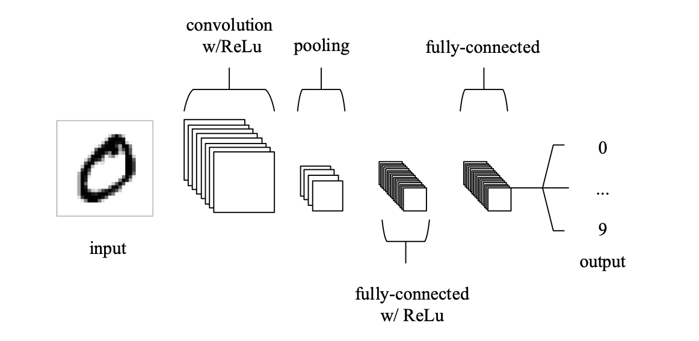

Figure 10: An simple CNN architecture, comprised of just five layers

Specifically, convolutional layers can be divided into one-dimensional convolution, two-dimensional convolution, and three-dimensional convolution according to dimensions. For one-dimensional convolution ([Conv1d](https://pytorch.org/docs/stable/generated/torch.nn.Conv1d.html#torch.nn.Conv1d)), we assume the input is $(C_{in},L)$, where $C_{in}$ represents the number of input channels and $L$ represents the length of the input. The output is $(C_{out},L_{out})$, where $C_{out}$ represents the number of output channels and $L_{out}$ represents the length of the output. The size of the convolution kernel is $(C_{out},C_{in},K)$, where $K$ represents the length of the convolution kernel. The formula for the convolution operation is as follows:

$$
C^{outj} = bias(C^{outj}) + \sum_{k=0}^{C_{in} - 1} Weight(C^{outj},k) \ast C^{inj} \tag{4.1}
$$

<!-- 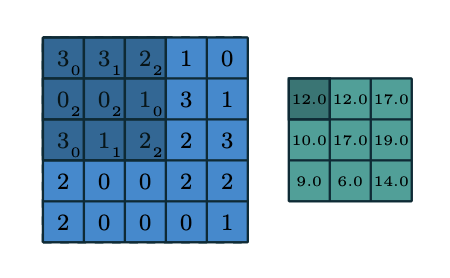 -->

Figure 11: An example of 2D convolution operation

Where $C^{outj}$ represents the $j$-th output channel, $C^{inj}$ represents the $j$-th input channel, $Weight(C^{outj},k)$ represents the weight of the $j$-th channel and the $k$-th channel of the convolution kernel, and $\ast$ represents the cross-correlation operation. For the cross-correlation operation, we have:

$$
(f * g)[n] = \sum_{m=-\infty}^{\infty} f[m] g[n + m] \tag{4.2}
$$

Where $n$ is the index variable, representing the translation of the signal. In the convolution operation, we usually use the cross-correlation operation to represent the convolution operation. In mathematics, the cross-correlation operation is usually used in signal processing and statistics to represent the similarity between two signals or functions. The difference between convolution operation and cross-correlation operation is that the convolution operation will flip the convolution kernel. For two-dimensional convolution and three-dimensional convolution, we can similarly define the convolution operation.

The pooling layer is mainly used for dimensionality reduction, and common pooling operations include max pooling and average pooling. Typically, we take one-dimensional max pooling ([MaxPool1d](https://pytorch.org/docs/stable/generated/torch.nn.MaxPool1d.html#torch.nn.MaxPool1d)) as an example. Assuming the input is $(C_{in},L)$, the output is $(C_{out},L_{out})$, and the size of the pooling kernel is $K$, the formula for the pooling operation is as follows:

$$
P^{outj} = \max_{k=0}^{K-1} P^{inj+k} \tag{4.3}
$$

The pooling operation is to take a fixed-size window on each channel of the input, and then take the maximum or average value in the window as the output.

<!-- 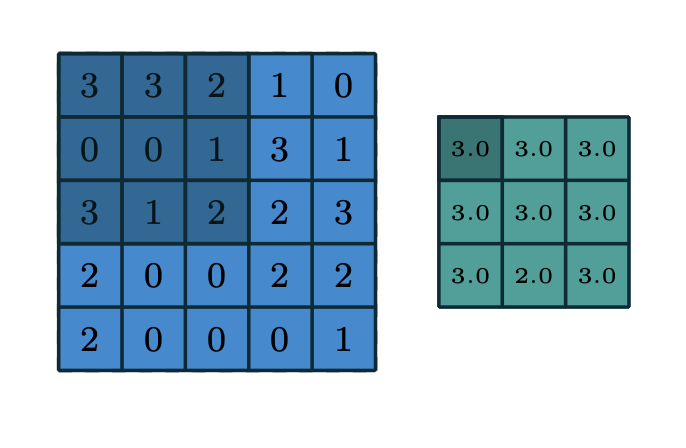 -->

Figure 12: An example of 2D max pooling operation

### 4.2 Long Short-Term Memory (LSTM)

LSTM[$^{14}$](#references)(Long Short-Term Memory) Network is a type of Recurrent Neural Network (RNN) with powerful sequence data modeling and prediction capabilities (e.g., time series). Compared with traditional feedforward fully connected networks, RNNs have recurrent connections that can "remember" certain patterns in the sequence, but due to the vanishing/exploding gradient problem, RNNs have difficulty in processing long sequences. LSTM networks solve the vanishing/exploding gradient problem by introducing gate units (e.g., forget gate, input gate, output gate), which can better handle long sequence data.

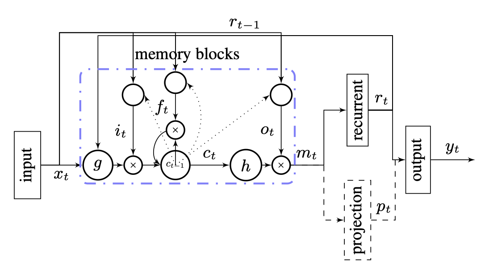

Figure 13: Classic LSTM Structure

$$
\begin{aligned}
i_t &= \sigma(W_{ii}x_t + b_{ii} + W_{hi}h_{t-1} + b_{hi})  \\ \tag{4.4}
f_t &= \sigma(W_{if}x_t + b_{if} + W_{hf}h_{t-1} + b_{hf})  \\ 
g_t &= \tanh(W_{ig}x_t + b_{ig} + W_{hg}h_{t-1} + b_{hg})  \\
o_t &= \sigma(W_{io}x_t + b_{io} + W_{ho}h_{t-1} + b_{ho})  \\
c_t &= f_t \odot c_{t-1} + i_t \odot g_t  \\
h_t &= o_t \odot \tanh(c_t)  \\
\end{aligned}
$$

Where $h_t$ represents the hidden state at time $t$, $c_t$ represents the cell state at time $t$, $x_t$ represents the input at time $t$, $i_t$ represents the input gate, $f_t$ represents the forget gate, $o_t$ represents the output gate, $g_t$ represents the new cell state.

Hadamard product $\odot$ is an element-wise product. For example :
$$
\begin{aligned} \tag{4.5}
\begin{bmatrix}
1 & 2 \\
3 & 4 \\
\end{bmatrix}
\odot
\begin{bmatrix}
5 & 6 \\
7 & 8 \\
\end{bmatrix}
= \begin{bmatrix}
1 \times 5 & 2 \times 6 \\
3 \times 7 & 4 \times 8 \\
\end{bmatrix}
\end{aligned}
$$

### 4.3 Ray Tracing Algorithm

Ray Tracing is a rendering technique in computer graphics that simulates the reflection of light rays to make the rendering results more vivid and realistic. This algorithm was initially proposed by Appel in 1968 and improved by Whitted in 1980 to a recursive algorithm and proposed a global illumination model. The basic idea of the Ray Tracing algorithm is to start from the viewpoint, trace the light rays backward along the line of sight until they return to the light source, calculate the intersection of the light rays with the objects, and then calculate the reflection, refraction, transmission, etc. of the light rays according to the material properties at the intersection, and finally obtain the color value of the pixel. The advantage of the Ray Tracing algorithm is that it can simulate the real light propagation process, which includes important methods such as the Phong Shading model, Radiosity, Photon Mapping, Monte Carlo methods, etc.

The typical Phong lighting model is the basis of the Ray Tracing algorithm, which includes three types of light effects: ambient light $\mathbf {I} _{a}$, diffuse light $\mathbf {I} _{d}$, and specular light $\mathbf {I} _{s}$. The calculation formulas for diffuse light and specular light are as follows:

$$
I_{\text{p}} = k_{\text{a}}I_{\text{a}} + k_{\text{d}}I_{\text{d}}(\mathbf {L} \cdot \mathbf {N} ) + k_{\text{s}}I_{\text{s}}(\mathbf {R} \cdot \mathbf {V} )^{\alpha }
$$

Where $I_{\text{p}}$ is the color value of the point, $k_{\text{a}}$, $k_{\text{d}}$, $k_{\text{s}}$ are the reflection coefficients of ambient light, diffuse light, and specular light, respectively, $\mathbf {L}$ is the light direction vector, $\mathbf {N}$ is the normal vector, $\mathbf {R}$ is the reflection light direction vector, $\mathbf {V}$ is the line of sight direction vector, and $\alpha$ is the specular coefficient.

## References
1. GPS: Theory, Algorithms and Applications, by Guochang Xu. Springer, 2007. doi: https://doi.org/10.1007/978-3-662-50367-6

2. Basilio, Lorena I., Richard L. Chen, Jeffery T. Williams, and David R. Jackson. "A New Planar Dual-Band GPS Antenna Designed for Reduced Susceptibility to Low-Angle Multipath." IEEE Transactions on Antennas and Propagation 55, no. 8 (2007): 2358-2366. doi: 10.1109/TAP.2007.901818

3. Kim, Sanghyun, Jungyun Byun, and Kwansik Park. "Machine Learning-Based GPS Multipath Detection Method Using Dual Antennas." arXiv preprint arXiv:2204.14001 (2022). doi: https://doi.org/10.48550/arXiv.2204.14001

4. Hsu, Li-Ta, Yanlei Gu, and Shunsuke Kamijo. "NLOS Correction/Exclusion for GNSS Measurement Using RAIM and City Building Models." Sensors 15, no. 7 (2015): 17329-17349. doi: 10.3390/s150717329

5. M. Obst, S. Bauer, P. Reisdorf and G. Wanielik, "Multipath detection with 3D digital maps for robust multi-constellation GNSS/INS vehicle localization in urban areas," 2012 IEEE Intelligent Vehicles Symposium, Madrid, Spain, 2012, pp. 184-190, doi: 10.1109/IVS.2012.6232285.

6. Paul Schwarzbach, Albrecht Michler, Oliver Michler. "3DMA Grid-based Hybrid 3DMA GNSS and Terrestrial Positioning." arXiv preprint arXiv:2309.05644 (2023). doi: https://doi.org/10.48550/arXiv.2309.05644

7. Evgenii Munin, Antoine Blais, Nicolas Couellan. "Convolutional Neural Network for Multipath Detection in GNSS Receivers." arXiv preprint arXiv:1911.02347 (2019). doi: https://arxiv.org/pdf/1911.02347

8. Ashwin V. Kanhere, Shubh Gupta, Akshay Shetty, Grace Gao. "Improving GNSS Positioning using Neural Network-based Corrections." arXiv preprint arXiv:2110.09581 (2021). doi: https://doi.org/10.48550/arXiv.2110.09581

9. Weisong Wen, Guohao Zhang, Li-Ta Hsu. "Exclusion of GNSS NLOS Receptions Caused by Dynamic Objects in Heavy Traffic Urban Scenarios Using Real-Time 3D Point Cloud: An Approach without 3D Maps." arXiv preprint arXiv:1804.10917 (2018). doi: https://doi.org/10.48550/arXiv.1804.10917

10. W. Wen, G. Zhang, L. Hsu, "UrbanLoco: A Full Sensor Suite Dataset for Mapping and Localization in Urban Scenes," 2020 IEEE International Conference on Robotics and Automation (ICRA), Paris, France, 2020, pp. 2310-2316, doi: 10.1109/ICRA40945.2020.9196526.

11. G. Zhang, P. Xu, H. Xu and L. -T. Hsu, "Prediction on the Urban GNSS Measurement Uncertainty Based on Deep Learning Networks With Long Short-Term Memory," in IEEE Sensors Journal, vol. 21, no. 18, pp. 20563-20577, 15 Sept.15, 2021, doi: 10.1109/JSEN.2021.3098006.

12. Wang, L., Groves, P. D., & Ziebart, M. K. (2015). Smartphone Shadow Matching for Better Cross-street GNSS Positioning in Urban Environments. Journal of Navigation, 68(3), 411-433. doi: 10.1017/S0373463314000836

13. Vincent Dumoulin, Francesco Visin. "A guide to convolution arithmetic for deep learning." arXiv preprint arXiv:1603.07285 (2016). doi: https://doi.org/10.48550/arXiv.1603.07285

14. Haşim Sak, Andrew Senior, Françoise Beaufays. "Long Short-Term Memory Based Recurrent Neural Network Architectures for Large Vocabulary Speech Recognition." arXiv preprint arXiv:1402.1128 (2014). doi: https://doi.org/10.48550/arXiv.1402.1128