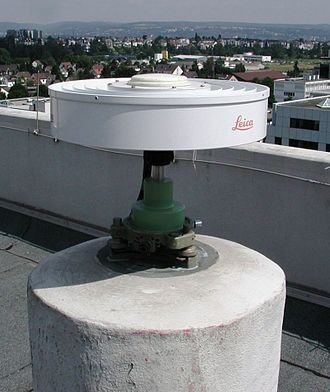

# Report 2 (20%) : 
> - PanZhiQing24037665g
> - Report 2 (20%) (submission date: 8 Nov)
> - Review of mitigation methods for GNSS multipath errors

> - 文献综述报告
> - 需要阅读4-10篇相关文献
> - 天线设计、信号处理方法、
> - big picture
> - 具体讲解一种方法，也可以只深入简介一种方法 Wen Duo Jie 及 Wu Chen 会阅读这些 report。

## Abstract

## Contents

## 1. Introduction

GPS Receiver will receive GPS satellite signals reflected from the surrounding environment. Compared to the direct signal received by the receiver, these reflected signals often take longer to reach the receiver, resulting in positioning errors. This phenomenon is also known as multipath effect. In general, the receiver may receive two types of signals at the same time (direct, multipath indirect) (as shown in Figure 1.1).

<!--  -->

Figures 1: Multipath effect on GNSS signal

As mentioned earlier, the impact of multipath effects is highly dependent on the local environment in which the receiver is located and the height of the satellite position. At the same time, the structural factors of the receiver should also be considered. Different receivers adopt different designs, so the effect of reducing multipath effects will also be different. Considering that the satellite is in motion, we can model the multipath effect as a function of time. Assuming that the signal received by the direct receiver is represented by:

$$
s(t) = A \cos(\omega t + \phi) \tag{1.1}
$$

The signal after multipath reflection is represented by:

$$
s'(t) = f \times s(t + \delta t) \tag{1.2}
$$

Where $f$ is the attenuation coefficient brought by the reflection, and $\delta t$ is the time delay.

Multipath effects essentially bring time delays, so their impact on positioning accuracy is proportional to the wavelength. For example, for P-code signals with a wavelength of about 30 meters, the impact of multipath effects is about 15 meters; for C/A signals, the wavelength is about 300 meters, and the impact of multipath effects is about 150 meters. If shorter wavelength carrier observations are used, the impact of multipath effects will be reduced to the centimeter level. Another characteristic of multipath effects is related to the GPS signal itself. The GPS signal is right-handed circularly polarized (RHCP), and the signal reflected by multipath effects will change this property. From the receiver's perspective, the signal's signal-to-noise ratio will be significantly reduced (1/3). Therefore, we can try to keep the receiver away from the reflecting surface as much as possible, or use carrier observations to mitigate the impact of multipath effects. In cases where C/A signals must be used, we can use phase-smoothed codes to reduce the impact of multipath effects.

If you want to accurately eliminate multipath effects, you need to detect the signals affected by multipath effects and weaken them. Generally, a combination of code and phase is used to detect multipath effects. Reviewing the pseudorange measurement model (Report1 4.4) and the carrier phase measurement model (Report1 4.8) in the previous report, we can derive a joint formula for detecting multipath effects:

$$
R_r^s(t_r,t_e) - \lambda \phi_r^s(t_r) = 2 \delta_{ion} + \lambda N_r^s + \delta_{mul} + \epsilon \tag{1.3}
$$

Where $R_r^s(t_r,t_e)$ is the pseudorange observation value, $\lambda \phi_r^s(t_r)$ is the carrier phase observation value, $\delta_{ion}$ is the ionospheric delay, $\lambda N_r^s$ is the integer ambiguity, $\delta_{mul}$ is the effect of multipath on code observation, and $\epsilon$ is the error of code observation. Since the error of carrier phase observation is much smaller than the error of code observation, we can detect multipath effects through carrier phase observation.

## 2. Review of GNSS Multipath Error Mitigation Methods

### 2.1 Receiver Design
GPS Antenna Design is one of the key factors in eliminating multipath interference. In most cases, the direct GPS signal comes from above horizontally, while the multipath signal comes from below horizontally; the GPS signal is right-handed circularly polarized, while the multipath signal may be left-handed circularly polarized. Therefore, under the premise of ensuring a clear view from above horizontally, the antenna design should minimize the reception of signals from below horizontally. In addition, side radiation and back radiation are also important sources of multipath interference.

A choke ring antenna is a directional antenna designed for reception of GNSS signals from satellites. It consists of a number of concentric conductive cylinders around a central antenna.

For example, the classic choke ring antenna, which is designed to reduce ground reflection and low-angle multipath interference. Some well-designed choke ring antennas installed in ground stations can provide millimeter-level accuracy, making GPS positioning information useful for geodetic and geophysical measurements.

Figure 2: A choke ring antenna (real photo).

Also, there are some small antenna designs, such as the Dual-Band GPS-RSW Antenna. The Dual-Band GPS-RSW Antenna is a patch antenna designed for dual-frequency GPS (L1 and L2) with reduced surface wave. It has a compact dual-layer concentric ring structure (inner and outer rings correspond to L1 and L2, respectively). This antenna performs well in the horizontal plane and back radiation, significantly reducing ground reflection and low-angle multipath interference, suitable for high-precision positioning applications.[$^2$](#References)

Figure 2: A dual-band reduced-surface-wave patch antenna (top view).

### 2.2 Improvement of Receiver Correlation Techniques

- Narrow correlator spacing
- Multipath Estimation Technology (MET)
- Multipath Eliminating Delay Lock Loop (MEDLL)

### 2.3 Filter-based Methods

Filtering with observables (pseudorange, carrier phase)
- Multipath Eliminating Delay Lock Loop (MEDLL)
从时间延迟的角度来看，多路径效应可以被视为一个延迟的信号，因此我们可以通过延迟锁相环（Delay Lock Loop, DLL）来消除多路径效应。延迟锁相环的基本原理是通过延迟输入信号，使得输入信号与延迟信号之间的相位差保持在一个固定的范围内，从而实现信号的同步。在 GPS 接收机中，延迟锁相环被广泛应用于消除多路径效应。

- Carrier smoothing
- Various Filtering Techniques
  - Finite impulse response (FIR) filter
  - Adaptive filter
  - Wavelet filter
  - Vondrak filter

The traditional method of detecting multipath signals uses the carrier-to-noise-density ratio (C/N0) measurement of the GNSS signal [47]. By defining a threshold for the C/N0 values, a signal with C/N0 greater than the threshold is classified as an LOS-only signal, and a signal with C/N0 lesser than the threshold is classified as an NLOS-only or LOS+NLOS signal. Similarly, there are numerous software- based detection algorithms for GNSS measurements, such as the Doppler shift and code-minus-carrier values [48], [49]. Additionally, there are hardware-based detection methods that use a special antenna [50], a sky-pointing camera [51], and a method that uses a three-dimensional (3D) model of a city and ray-tracing techniques [52]. Furthermore, GNSS multipath signal detection techniques using machine learning approaches have been emerging recently [53]–[55].

### 2.4 Combination of Computer Science Methods

With the development of computer technology, people's ability to model the real world is also constantly improving. Compared with traditional methods based on empirical formulas, filters, etc., it is now possible to perform more detailed modeling and analysis through computers. For example, the use of machine learning algorithms to detect multipath signals in GNSS measurements has been proposed in recent years.[$^3$](#References) In addition, the use of 3D models of cities and ray-tracing techniques to detect multipath signals has also been proposed.[$^{4,5}$](#References)

#### 2.4.1. Machine Learning-based Methods
The machine learning-based GPS multipath detection method proposed by Kim et al. uses four features (i.e., C/N0, time difference of C/N0, difference between pseudorange time difference and pseudorange rate, satellite elevation angle) and one feature (i.e., double-difference pseudorange residual of dual antennas). The four machine learning algorithms used in the study are GBDT, Random Forest, Decision Tree, and K-Nearest Neighbor (KNN).[$^3$](#References)

#### 2.4.2. 3D Model-based Methods

We mentioned earlier that multipath effects are related to the local environment of the receiver and the height of the satellite position. In other words, the impact of multipath effects can be modeled by a computer. In Google Earth, more and more cities have detailed digital models. By combining these models with ray tracing techniques, we can quantify the multipath effects caused by buildings in the city and effectively reduce their impact.

Through randomly selecting sampling points near the receiver (e.g., within 15m), combined with the city's digital model and ray tracing techniques, we can calculate the simulated pseudorange value of each sampling point. Combined with the real measured pseudorange, these simulated pseudoranges can be used to correct the real pseudorange observations (e.g., weighted average based on similarity) and detect outliers (e.g., multipath signals reflected two or more times).

Figure 4: Multipath detection with 3D digital maps for robust multi-constellation GNSS/INS vehicle localization in urban areas.

With the gradual maturity of technologies such as autonomous driving, the digital models of the surrounding environment can also be dynamically generated through vehicle-mounted radar. This dynamic 3D map can be fully combined with the vehicle-mounted GNSS receiver to achieve real-time detection and reduction of multipath effects, thereby improving the positioning accuracy of the vehicle-mounted GNSS in urban roads.

## 3. Comparative Analysis of GNSS Techniques

## 4. Multipath Effects can be useful

## References
1. GPS: Theory, Algorithms and Applications, by Guochang Xu. Springer, 2007. doi: https://doi.org/10.1007/978-3-662-50367-6

2. Basilio, Lorena I., Richard L. Chen, Jeffery T. Williams, and David R. Jackson. "A New Planar Dual-Band GPS Antenna Designed for Reduced Susceptibility to Low-Angle Multipath." IEEE Transactions on Antennas and Propagation 55, no. 8 (2007): 2358-2366. doi: 10.1109/TAP.2007.901818

3. Kim, Sanghyun, Jungyun Byun, and Kwansik Park. "Machine Learning-Based GPS Multipath Detection Method Using Dual Antennas." arXiv preprint arXiv:2204.14001 (2022). doi: https://doi.org/10.48550/arXiv.2204.14001

4. Hsu, Li-Ta, Yanlei Gu, and Shunsuke Kamijo. "NLOS Correction/Exclusion for GNSS Measurement Using RAIM and City Building Models." Sensors 15, no. 7 (2015): 17329-17349. doi: 10.3390/s150717329

5. M. Obst, S. Bauer, P. Reisdorf and G. Wanielik, "Multipath detection with 3D digital maps for robust multi-constellation GNSS/INS vehicle localization in urban areas," 2012 IEEE Intelligent Vehicles Symposium, Madrid, Spain, 2012, pp. 184-190, doi: 10.1109/IVS.2012.6232285.

